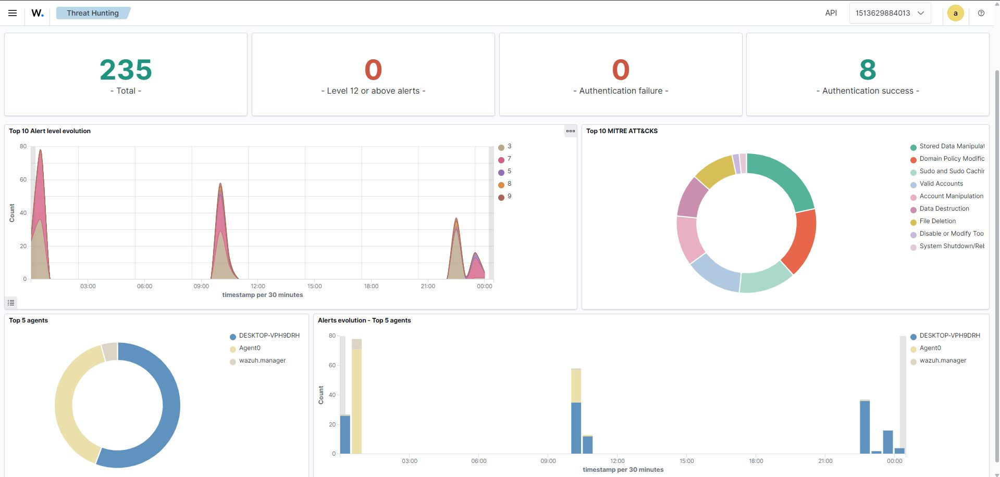
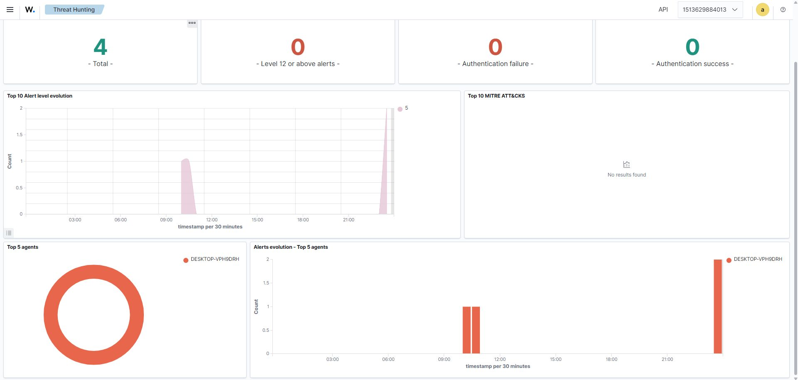
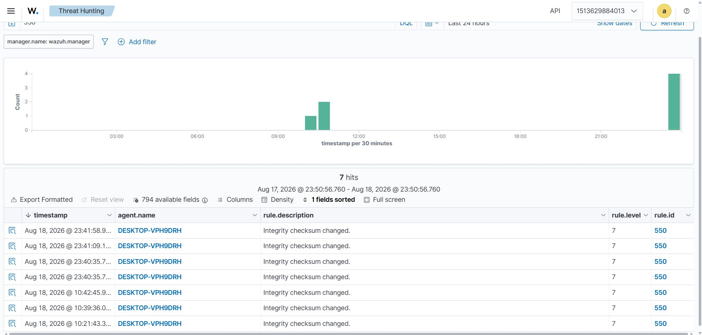
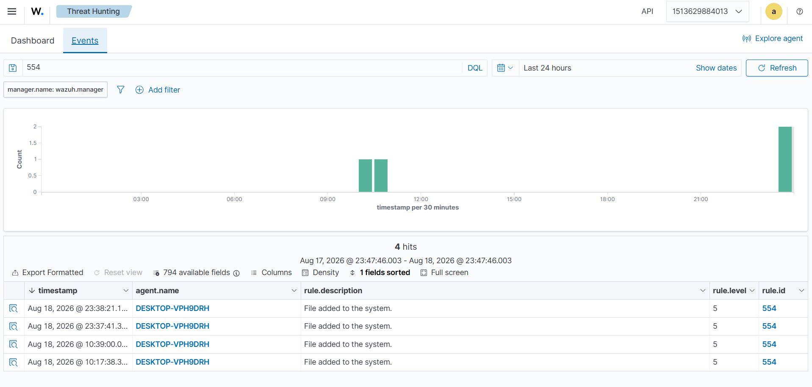
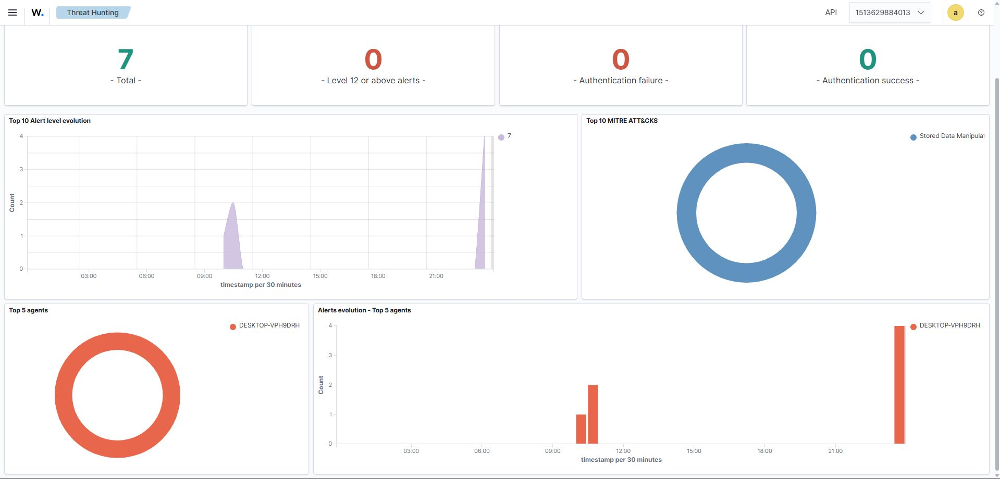
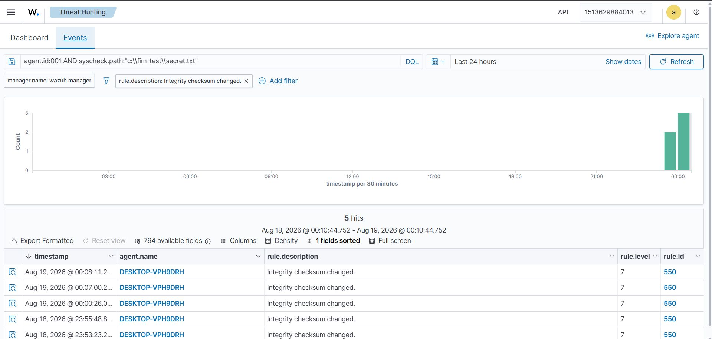

# 🛡️ Lab 1 --- File Integrity Monitoring with Wazuh

### Detecting, Investigating and Understanding File Changes on an Endpoint


> **Lab objective:** Build practical experience with Wazuh File
> Integrity Monitoring (FIM) by generating controlled file activity,
> observing the resulting security telemetry, identifying the rules
> responsible for the alerts, and understanding how file integrity
> changes can become an investigation starting point for a SOC analyst.

------------------------------------------------------------------------

## 📌 Overview

File Integrity Monitoring is one of the most useful host-based
monitoring capabilities for a SOC analyst because it provides visibility
into changes made to files on monitored endpoints.

In this lab, I moved beyond simply learning what FIM is and tested how
different file operations are represented as security events inside
Wazuh.

The practical workflow was:

``` text
File Activity
     ↓
Wazuh FIM Detects Change
     ↓
Security Event Generated
     ↓
Wazuh Rule Identifies Event
     ↓
Threat Hunting / Event Investigation
     ↓
File Integrity Changes Analyzed
```

The lab focused on understanding the relationship between an action
performed on an endpoint and the security telemetry generated by Wazuh.

------------------------------------------------------------------------

## 🎯 Objectives

The main objectives of this lab were to:

-   Understand the purpose of File Integrity Monitoring.
-   Configure and use Wazuh FIM for endpoint monitoring.
-   Monitor a controlled test location on the endpoint.
-   Generate different types of file changes.
-   Observe how Wazuh represents those changes as alerts.
-   Identify the Wazuh rule responsible for an alert.
-   Investigate events using Wazuh Threat Hunting.
-   Understand the difference between file creation and integrity
    modification events.
-   Compare file hashes before and after a modification.
-   Understand why unexpected file changes can be important to a SOC
    analyst.
-   Practice thinking about file changes from a detection and
    investigation perspective rather than only from a
    system-administration perspective.

------------------------------------------------------------------------

## 🧪 Lab Scenario

A controlled test file was used to simulate activity that a SOC analyst
might want to monitor on an endpoint.

The monitored test file shown in the Wazuh investigation screenshots
was:

``` text
C:\fim-test\secret.txt
```

The Wazuh endpoint visible in the investigation evidence is:

``` text
Agent: DESKTOP-VPH9DRH
```

The goal was not to use real malware or perform destructive activity.
Instead, controlled file operations were used to understand how Wazuh
FIM detects and records changes.

------------------------------------------------------------------------

## 🖥️ Lab Environment

  ----------------------------------------------------------------------
  Component                                   Role
  ------------------------------------------- --------------------------
  **Wazuh Manager**                           Receives, analyzes and
                                              generates security alerts

  **Wazuh Dashboard / Threat Hunting**        Used to search and
                                              investigate events

  **Wazuh Agent**                             Collects endpoint
                                              telemetry

  **Windows Endpoint**                        Endpoint where the
                                              controlled file activity
                                              was generated

  **Test File**                               `C:\fim-test\secret.txt`
  ----------------------------------------------------------------------

### High-Level Architecture

``` text
┌──────────────────────────────┐
│       Windows Endpoint       │
│                              │
│  C:\fim-test\secret.txt     │
│                              │
│  Create / Modify / Rename    │
│  Delete / Permission Change  │
└──────────────┬───────────────┘
               │
               │ Wazuh Agent
               ▼
┌──────────────────────────────┐
│        Wazuh Manager         │
│                              │
│  FIM / Syscheck Analysis     │
│  Rule Matching               │
│  Alert Generation            │
└──────────────┬───────────────┘
               │
               ▼
┌──────────────────────────────┐
│       Wazuh Threat Hunting   │
│                              │
│  Event Search                │
│  Rule Identification         │
│  File Change Investigation   │
└──────────────────────────────┘
```

------------------------------------------------------------------------

## 🔍 What is File Integrity Monitoring?

File Integrity Monitoring (FIM) is a security control that detects
changes to files and directories that have been selected for monitoring.

Depending on the event and configuration, FIM can provide visibility
into activities such as:

-   File creation
-   File modification
-   File deletion
-   File renaming
-   Permission or attribute changes
-   Integrity/hash changes

The important security idea is that **a file change is not automatically
malicious, but an unexpected file change can be an important
investigation signal.**

For example, a change to a critical configuration file could be caused
by:

-   A legitimate software update
-   An administrator making a change
-   A scheduled maintenance task
-   A misconfiguration
-   An unauthorized user
-   Malware modifying a file
-   An attacker changing system or application files

FIM gives the SOC visibility into that change so the analyst can
determine what actually happened.

------------------------------------------------------------------------

## ⚙️ FIM Monitoring Concept

The Wazuh agent monitors the configured location and reports file
integrity events to the Wazuh manager.

Conceptually:

``` text
Configured File / Directory
          ↓
    Wazuh Syscheck
          ↓
File Metadata / Integrity Data
          ↓
    Wazuh Manager
          ↓
     Rule Matching
          ↓
       Alert
```

The monitored test location used for the exercise was:

``` text
C:\fim-test
```

with the investigation evidence focusing on:

``` text
C:\fim-test\secret.txt
```

------------------------------------------------------------------------

## 🧪 Controlled File Activity

The lab intentionally tested multiple types of file activity instead of
relying on a single modification.

### 1. File Creation

A test file was created inside the monitored location.

The purpose was to verify that Wazuh could detect the appearance of a
new file.

The resulting event was associated with **Rule 554 ---
`File added to the system.`**

### 2. File Modification

The contents of the test file were changed.

This was important because a modification changes the file's integrity
state and can result in a different hash value.

### 3. File Rename

The test file was renamed to observe how file activity is represented by
the monitoring system.

### 4. File Deletion

The test file was deleted to verify visibility into removal of a
monitored object.

### 5. Permission Change

File permissions were changed as another example of an integrity-related
modification that can be relevant during endpoint investigations.

> **SOC perspective:** The important lesson was not simply that Wazuh
> can detect these actions. The more important lesson is that different
> endpoint actions produce different pieces of telemetry that an analyst
> can use to reconstruct what happened.

------------------------------------------------------------------------

## 📊 Evidence --- Wazuh Threat Hunting Overview

The following screenshot shows the Wazuh Threat Hunting dashboard with
endpoint security telemetry and alert visualizations.



### What this demonstrates

The dashboard provides a high-level view of security events collected by
Wazuh. The displayed environment contains endpoint activity and
alert-level information that can be used as a starting point for
investigation.



The timeline places the observed FIM activity in chronological context, which helps when correlating file changes with other endpoint or authentication events.

For a SOC analyst, a dashboard is useful for identifying unusual
activity, but the analyst normally needs to move from the overview into
individual events to understand the actual file change.

------------------------------------------------------------------------

## 🔎 Investigating File Creation Events

After generating controlled file activity, the next step was to
investigate the events inside Wazuh Threat Hunting.

The event search showed multiple hits associated with the Windows
endpoint.

The relevant event description was:

``` text
File added to the system.
```

The Wazuh rule shown in the evidence was:

``` text
Rule ID: 554
Rule Level: 5
Description: File added to the system.
```



### Investigation interpretation

This event tells the analyst that Wazuh detected a new file on the
monitored endpoint.

However, the alert itself does **not** mean that the file is malicious.

A SOC analyst would next ask:

1.  What file was created?
2.  Where was it created?
3.  Which endpoint generated the event?
4.  Which user or process created it?
5.  Was the activity expected?
6.  What was the file's original state?
7.  Did the file change after creation?
8.  Does the file hash match a known trusted or malicious file?

This is where FIM becomes part of a larger investigation workflow.



The event-level view lets the analyst focus on the individual telemetry generated by the monitored endpoint rather than relying only on the dashboard summary.

------------------------------------------------------------------------

## 🔐 Investigating Integrity Changes

One of the most important parts of the lab was observing what happened
when the file contents changed.

Wazuh generated events with the description:

``` text
Integrity checksum changed.
```

The evidence shows:

``` text
Rule ID: 550
Rule Level: 7
Description: Integrity checksum changed.
```



The investigation view shows repeated Rule 550 events for the monitored
file.



### Why Rule 550 matters

The event indicates that the integrity state of a monitored file
changed.

From a SOC perspective, this can be significant because attackers may
modify files as part of activities such as:

-   Persistence
-   Configuration manipulation
-   Malware installation
-   Web shell placement
-   Log tampering
-   Security-control modification
-   Credential or application data manipulation

At the same time, legitimate applications and administrators also modify
files. Therefore, **context is critical**.

------------------------------------------------------------------------

## 🧮 File Hash Comparison

A key part of the lab was understanding how file integrity can be
represented using cryptographic hashes.

A hash acts as a fingerprint for the contents of a file.

Conceptually:

``` text
Original File
     │
     ▼
 Hash Calculation
     │
     ▼
Original Hash

       ↓ File Modified ↓

Modified File
     │
     ▼
 Hash Calculation
     │
     ▼
New Hash
```

If the contents change, the resulting hash normally changes as well.

For example:

``` text
Before Modification
SHA-256: <original_hash>

After Modification
SHA-256: <new_hash>
```

The exact values should be recorded from the endpoint during the
investigation rather than manually fabricated in documentation.

### Why hashes are useful to a SOC analyst

Hash values allow an analyst to:

-   Track a specific file state.
-   Compare a file before and after modification.
-   Search threat-intelligence databases.
-   Compare the same file across endpoints.
-   Identify known malicious files.
-   Support incident investigation and evidence collection.

This becomes especially powerful when FIM is combined with threat
intelligence, endpoint telemetry, and process information.

------------------------------------------------------------------------

## 🕵️ Threat Hunting Workflow

The lab introduced a simple but important threat-hunting workflow.

``` text
1. Observe an alert
        ↓
2. Identify the affected endpoint
        ↓
3. Identify the affected file
        ↓
4. Identify the Wazuh rule
        ↓
5. Determine what changed
        ↓
6. Compare integrity information / hashes
        ↓
7. Determine whether the change was expected
        ↓
8. Correlate with other telemetry if required
        ↓
9. Decide whether escalation is necessary
```

The key point is that **an alert is the beginning of an investigation,
not the end of one.**

------------------------------------------------------------------------

## 📋 Evidence Summary

  ---------------------------------------------------------------------
  Evidence                      Observation
  ----------------------------- ---------------------------------------
  Wazuh interface               Threat Hunting used for investigation

  Endpoint                      `DESKTOP-VPH9DRH`

  Test path                     `C:\fim-test\secret.txt`

  File creation rule            Rule `554`

  File creation severity        Level `5`

  File creation message         `File added to the system.`

  Integrity modification rule   Rule `550`

  Integrity modification        Level `7`
  severity                      

  Integrity modification        `Integrity checksum changed.`
  message                       

  Investigation method          Threat Hunting / event filtering

  Integrity analysis            File hashes compared before and after
                                modification
  ---------------------------------------------------------------------

------------------------------------------------------------------------

## 📸 Evidence --- Event Search for the Monitored File

The following screenshot shows the event search narrowed to the
monitored test file and the integrity-change rule.


The query visible in the evidence identifies the test file:

``` text
agent.id:001 AND syscheck.path:"C:\fim-test\secret.txt"
```

The results show multiple events for the same endpoint and file, with
Rule 550 reporting integrity checksum changes.

This is a useful example of how a SOC analyst can narrow a broad stream
of telemetry down to a single endpoint and file during an investigation.

------------------------------------------------------------------------

## 🧠 What I Learned

This lab changed my understanding of FIM from a simple "file monitoring"
feature into a useful security investigation capability.

The practical flow was:

``` text
Create
   ↓
Wazuh detects the file
   ↓
Rule 554 generates an alert
   ↓
Modify
   ↓
Wazuh detects the integrity change
   ↓
Rule 550 generates an alert
   ↓
Investigate the event
   ↓
Identify the affected file
   ↓
Compare file integrity / hashes
```

A simple file modification can therefore become the first observable
signal in a larger security investigation.

------------------------------------------------------------------------

## 🚨 SOC Relevance

FIM is highly relevant to Security Operations because file changes can
provide useful evidence during endpoint investigations.

### Example SOC scenario

Imagine an analyst receives an alert indicating that a sensitive
configuration file changed on a production server.

The analyst could investigate:

``` text
FIM Alert
   ↓
What file changed?
   ↓
When did it change?
   ↓
Which endpoint changed?
   ↓
Who made the change?
   ↓
Which process made the change?
   ↓
Was the change expected?
   ↓
Did the file hash change?
   ↓
Is the new file known or suspicious?
   ↓
Are there related authentication/network/process alerts?
   ↓
Incident or False Positive?
```

This is the kind of reasoning a SOC analyst needs when moving from alert
monitoring to investigation.

------------------------------------------------------------------------

## 🔗 FIM + Other Security Controls

FIM becomes considerably more useful when correlated with other security
telemetry.

  ---------------------------------------------------------------------
  Data Source                  What It Can Add
  ---------------------------- ----------------------------------------
  **FIM**                      What file changed

  **Authentication Logs**      Who accessed the system

  **Auditd**                   What commands/actions were executed

  **Process Telemetry**        Which process performed an action

  **Network Telemetry**        Whether suspicious communication
                               occurred

  **Threat Intelligence**      Whether a hash/IP/domain is known
                               malicious

  **SIEM Correlation**         Connect multiple events into one
                               investigation
  ---------------------------------------------------------------------

This is why FIM should not be treated as an isolated security feature.
It is one source of endpoint evidence within a broader detection and
response workflow.

------------------------------------------------------------------------

## ⚠️ False Positives and Analyst Context

Not every FIM alert represents an attack.

Common legitimate causes include:

-   Operating-system updates
-   Application updates
-   Configuration changes
-   Administrator activity
-   Automated maintenance jobs
-   Log rotation
-   Software installation

A SOC analyst should therefore avoid treating every file-change alert as
malicious.

A better approach is:

``` text
Alert
 ↓
Validate
 ↓
Understand Context
 ↓
Correlate
 ↓
Determine Risk
 ↓
Escalate / Close
```

This distinction between **detection** and **investigation** is one of
the most important lessons from this lab.

------------------------------------------------------------------------

## 🧩 Detection vs Investigation

### Detection

Wazuh identifies that a file event occurred.

Example:

``` text
Rule 550
Integrity checksum changed.
```

### Investigation

The analyst determines why the change happened and whether it is
suspicious.

Example questions:

``` text
What changed?
Who changed it?
Why did it change?
Was the change authorized?
What process caused it?
What was the file before the change?
What is the new hash?
Are there related alerts?
```

This distinction is central to SOC work.

------------------------------------------------------------------------

## 📌 Key Takeaways

### 1. FIM provides endpoint visibility

It allows security teams to detect changes to monitored files and
directories.

### 2. Alerts need investigation

A file-change alert is a signal, not automatically a confirmed incident.

### 3. Rules provide context

In this lab, Rule 554 identified a file-added event, while Rule 550
identified an integrity checksum change.

### 4. Hashes are valuable investigation artifacts

Comparing hashes provides a reliable way to identify changes in file
contents.

### 5. Context determines severity

The same type of file change can be harmless in one situation and highly
suspicious in another.

### 6. FIM fits into a larger SOC workflow

FIM becomes more powerful when correlated with authentication, process,
network, audit and threat-intelligence data.

------------------------------------------------------------------------


## 🧪 Lab Outcome

The lab successfully demonstrated the complete basic FIM investigation
cycle:

``` text
Controlled File Activity
        ↓
Wazuh FIM Detection
        ↓
Alert Generation
        ↓
Rule Identification
        ↓
Threat Hunting
        ↓
File Integrity Analysis
        ↓
Hash Comparison
        ↓
SOC Investigation Context
```

The practical takeaway was simple but important:

> **A small file change can become the starting point for a much larger
> security investigation.**

------------------------------------------------------------------------

## 🔐 Security Note

All activity in this lab was performed in a controlled practice
environment for defensive security learning.

No real malware was required for this exercise. The purpose was to
understand endpoint telemetry, FIM alerts, investigation techniques, and
the SOC analyst mindset.

------------------------------------------------------------------------

## 🔗 Related Work

This lab is **Lab 1** in the Wazuh SOC Labs repository and establishes
the endpoint-monitoring foundation for the later labs.

**Next:** [Lab 2 --- Suricata IDS +
Wazuh](./Lab-2-Suricata-IDS-Wazuh.md)

------------------------------------------------------------------------

## 👨‍💻 Author

**Josh Yadav**\

------------------------------------------------------------------------

### 🛡️ Detection is only the beginning.

**Detect → Investigate → Understand → Respond**
