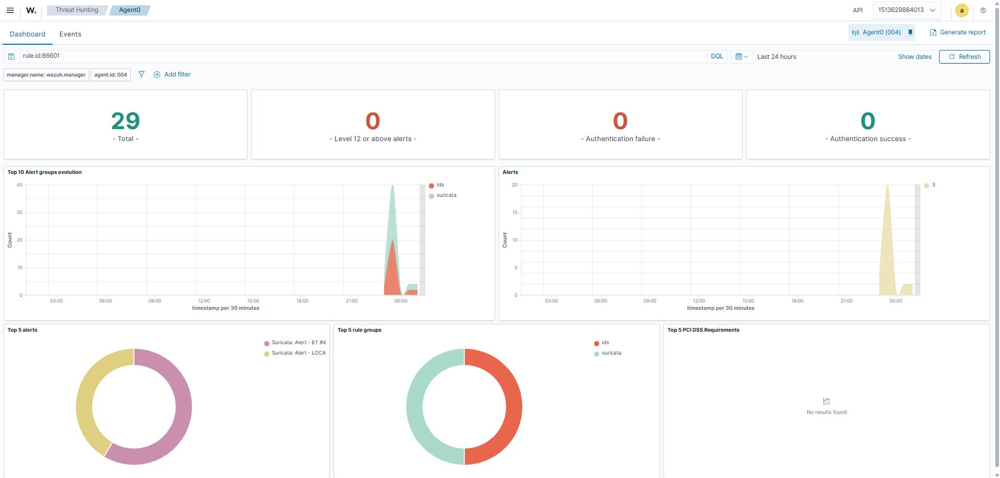
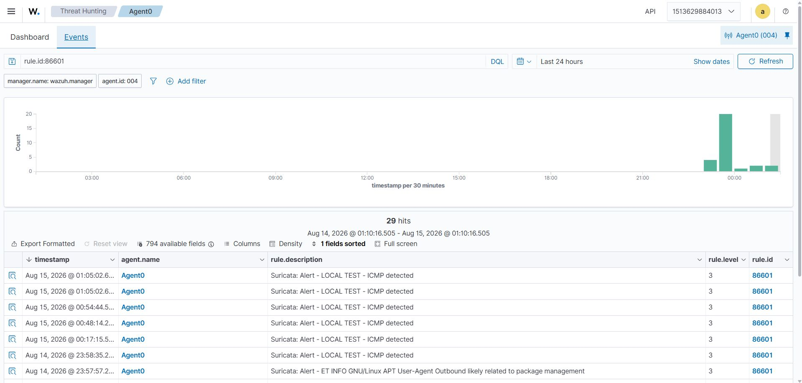
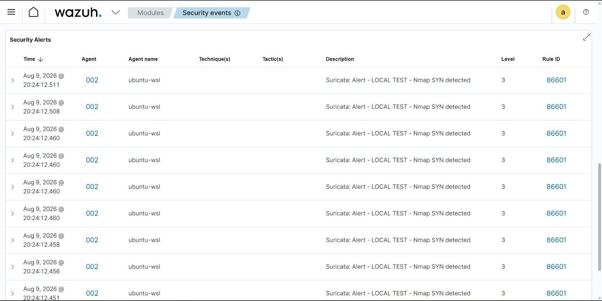
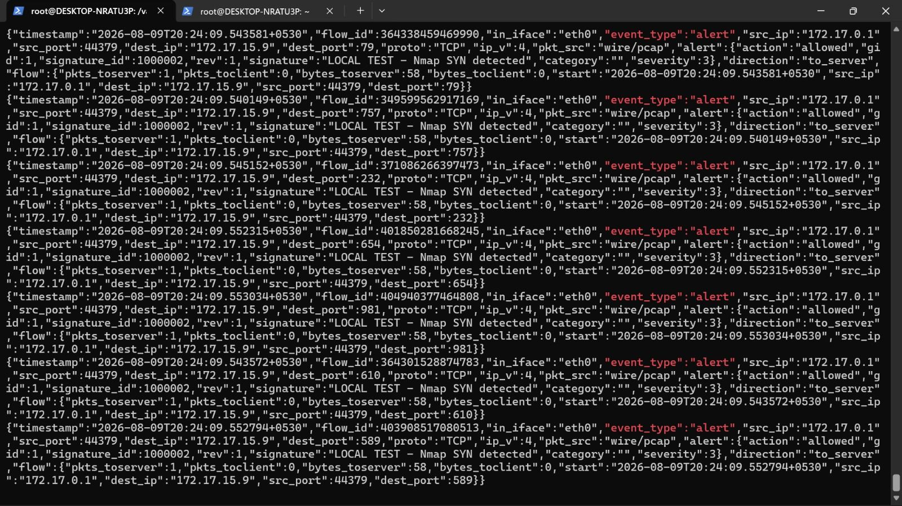

# 🌐 Lab 2 — Suricata IDS Logs Through Wazuh

> **Network Security Monitoring | IDS Detection | Log Analysis | SIEM Investigation**

---

## 📌 Overview

A network packet is only raw activity until a security tool can give it context.

In this lab, I built and investigated a practical **Suricata IDS → Wazuh SIEM** detection pipeline. The goal was to understand what network activity looks like from an intrusion detection perspective and how Suricata-generated events become searchable security alerts inside Wazuh.

I tested two types of network activity:

- **ICMP traffic** using a custom Suricata detection rule
- **Nmap-generated network activity** to observe TCP SYN-based scanning behavior

The investigation moved through the complete pipeline:

```text
Network Traffic
      ↓
  Suricata IDS
      ↓
 Suricata JSON Logs
      ↓
 Wazuh Decoder / Rules
      ↓
 Wazuh Security Alerts
      ↓
 Threat Hunting / Investigation
```

This lab was particularly useful for understanding the difference between **network telemetry**, an **IDS signature**, a **SIEM alert**, and the investigation context an analyst needs to make a security decision.

---

## 🎯 Objectives

The main objectives of this lab were to:

- Understand how Suricata operates as a Network Intrusion Detection System (NIDS)
- Generate controlled ICMP traffic and observe the resulting detection
- Create and test a custom Suricata rule for ICMP traffic
- Generate Nmap-based network activity
- Analyze Suricata JSON/EVE logs
- Forward Suricata events into Wazuh
- Understand how Wazuh processes Suricata events
- Identify Suricata signature IDs and Wazuh rule IDs
- Investigate source and destination IP addresses
- Analyze ports, protocols, timestamps, severity, and alert actions
- Distinguish normal/expected network activity from potentially suspicious scanning behavior
- Practice a SOC-style investigation workflow using network security telemetry

---

## 🧠 Why This Lab Matters in a SOC

A SOC analyst rarely investigates a packet directly.

Instead, security tools transform network activity into structured telemetry:

```text
Packet
  ↓
Network IDS
  ↓
Detection Signature
  ↓
Structured Event
  ↓
SIEM Alert
  ↓
Analyst Investigation
```

Suricata provides the **network detection layer**, while Wazuh provides the **centralized monitoring and investigation layer**.

This combination allows an analyst to ask questions such as:

- Who generated the traffic?
- Which host received it?
- Which protocol was involved?
- Which port was targeted?
- Which Suricata signature triggered?
- What was the severity?
- Was the packet allowed or blocked?
- When did the activity occur?
- Did multiple alerts occur close together?
- Does the pattern resemble scanning, reconnaissance, or another suspicious behavior?

That is the type of reasoning expected during a network-security investigation.

---

# 🏗️ Lab Architecture

```text
                         Network Activity
                                │
                    ┌───────────┴───────────┐
                    │                       │
                 ICMP Traffic            Nmap Scan
                    │                       │
                    └───────────┬───────────┘
                                ↓
                         ┌─────────────┐
                         │  Suricata   │
                         │     IDS     │
                         └──────┬──────┘
                                │
                         EVE JSON Logs
                                │
                                ↓
                         ┌─────────────┐
                         │    Wazuh    │
                         │   Agent     │
                         └──────┬──────┘
                                │
                                ↓
                         ┌─────────────┐
                         │    Wazuh    │
                         │   Manager   │
                         └──────┬──────┘
                                │
                                ↓
                         ┌─────────────┐
                         │ Threat      │
                         │ Hunting     │
                         └──────┬──────┘
                                │
                                ↓
                       SOC Investigation
```

---

## 🛠️ Technologies Used

| Technology | Role |
|---|---|
| **Suricata** | Network Intrusion Detection System |
| **Wazuh** | SIEM / endpoint and security monitoring platform |
| **Nmap** | Controlled network reconnaissance / scan generation |
| **Linux / WSL** | Lab environment |
| **JSON / EVE logs** | Structured Suricata event format |
| **Wazuh Threat Hunting** | Alert search and investigation |

---

# 1. 🔎 Understanding Suricata

Suricata is an open-source network security monitoring engine capable of detecting suspicious network traffic using signatures and protocol-aware inspection.

For this lab, the important concept was:

```text
Traffic → Suricata → Signature Match → Alert → JSON Event
```

Instead of simply seeing that a packet existed, Suricata can attach security context to the traffic.

A Suricata alert can contain information such as:

- Timestamp
- Source IP
- Source port
- Destination IP
- Destination port
- Protocol
- Signature ID
- Signature message
- Severity
- Action
- Flow information

These fields become extremely valuable once the events are forwarded into a SIEM.

---

# 2. 🧪 ICMP Detection

The first network activity tested in the lab was **ICMP traffic**.

ICMP is commonly associated with utilities such as `ping`, but from a security monitoring perspective it is also useful telemetry.

ICMP activity can help an analyst understand:

- Host discovery
- Reachability testing
- Network troubleshooting
- Potential reconnaissance
- Repeated probing behavior

For the lab, I created a **custom Suricata rule designed to detect ICMP traffic**.

The purpose was not to treat every ICMP packet as malicious.

Instead, the goal was to deliberately generate known traffic and verify that the IDS could:

```text
Detect → Log → Forward → Alert → Investigate
```

---

## 🧩 Custom Detection Concept

The custom rule was used as a controlled detection mechanism for the lab.

Conceptually:

```text
ICMP packet
     ↓
Suricata inspects traffic
     ↓
Custom ICMP signature matches
     ↓
Suricata generates alert
     ↓
Alert written to JSON/EVE log
```

This was useful because it allowed the detection pipeline to be tested with traffic whose origin and purpose were known.

---

# 3. 📊 ICMP Alerts in Wazuh

After generating ICMP traffic, I investigated the resulting Suricata events in Wazuh.

The Wazuh Threat Hunting dashboard showed Suricata activity associated with the monitored agent.



The dashboard provides a higher-level view of the collected security telemetry.

In the captured environment, the Suricata events were associated with:

- **Agent:** `Agent0`
- **Agent ID:** `004`
- **Rule ID:** `86601`
- **Rule level:** `3`

The dashboard also showed alert-group activity associated with both `ids` and `suricata`.

This is important from a SOC perspective because the analyst can move from a high-level dashboard into the underlying events instead of investigating every raw log manually.

---

# 4. 🔍 Investigating the ICMP Events

The next step was to narrow the investigation to the Suricata detection.

The Wazuh Events view showed the generated alerts and their associated metadata.



The captured events show:

```text
Rule ID:       86601
Rule Level:    3
Agent:         Agent0
Agent ID:      004
```

The event description included:

```text
Suricata: Alert - LOCAL TEST - ICMP detected
```

This demonstrates an important SIEM workflow:

```text
Raw network activity
        ↓
Suricata signature
        ↓
Suricata event
        ↓
Wazuh rule
        ↓
Searchable alert
```

The **Suricata signature** describes what the IDS detected, while the **Wazuh rule** is the rule representation used by Wazuh when processing the event.

---

# 5. 🧭 Moving From ICMP to Nmap Activity

After validating the ICMP detection pipeline, I moved to a more reconnaissance-oriented scenario using **Nmap-generated network activity**.

Nmap is commonly used for legitimate network discovery and security testing, but the traffic it generates is also useful for understanding what reconnaissance can look like from an IDS perspective.

The investigation therefore shifted from:

```text
"Can Suricata detect this traffic?"
```

to:

```text
"What does the traffic look like when viewed as an IDS event?"
```

This distinction is important for SOC work.

A security analyst should not automatically classify every scan as malicious. The analyst needs to establish:

- Source
- Destination
- Timing
- Targeted ports
- Protocol
- Signature
- Frequency
- Context
- Whether the activity was authorized

---

# 6. 🚨 Nmap Detection in Wazuh

The Nmap-generated traffic produced Suricata alerts that were visible through Wazuh.

The Security Alerts view showed repeated detections associated with the Nmap activity.



The captured evidence shows:

```text
Agent:         ubuntu-wsl
Agent ID:      002
Rule ID:       86601
Rule Level:    3
Description:   Suricata: Alert - LOCAL TEST - Nmap SYN detected
```

The repeated events demonstrate how a single scan can generate multiple IDS events.

From a SOC perspective, repeated detections are often more useful than an isolated event because the analyst can begin looking for behavioral patterns.

For example:

```text
One connection
     ↓
Several connection attempts
     ↓
Multiple destination ports
     ↓
Repeated IDS detections
     ↓
Possible reconnaissance pattern
```

The final classification still depends on context.

---

# 7. 🧾 Inspecting the Raw Suricata JSON

One of the most useful parts of this lab was looking beyond the Wazuh alert and examining the underlying Suricata JSON data.

The raw events contained fields such as:

```text
timestamp
src_ip
src_port
dest_ip
dest_port
proto
event_type
alert.action
alert.gid
alert.signature_id
alert.rev
alert.signature
alert.severity
flow
```



The captured JSON shows the custom Nmap detection signature:

```text
signature_id: 1000002
signature:     LOCAL TEST - Nmap SYN detected
severity:      3
action:        allowed
```

It also shows individual destination ports, demonstrating that the Nmap activity produced multiple connection attempts.

Examples visible in the captured telemetry include destination ports such as:

```text
79
757
232
654
981
610
589
```

The important lesson is that an IDS alert is not just a message.

It is structured evidence.

---

# 8. 🔬 What I Looked For During Investigation

During the investigation, I focused on the fields that a SOC analyst would normally extract first.

## Source IP

The source IP helps identify where the activity originated.

In the captured JSON evidence:

```text
src_ip: 172.17.0.1
```

The source should always be interpreted in the context of the lab network. An IP address by itself does not prove malicious intent.

---

## Destination IP

The destination identifies the system receiving the traffic.

The captured evidence included:

```text
dest_ip: 172.17.15.9
```

This creates the basic investigation relationship:

```text
Source → Destination
```

---

## Source and Destination Ports

The port fields provide additional context about what the traffic was attempting to reach.

For example:

```text
src_port: 44379
dest_port: 79
```

Other events in the captured scan included different destination ports.

This is one of the characteristics that made the Nmap activity useful for demonstrating reconnaissance behavior.

---

## Protocol

The captured Nmap events were TCP traffic:

```text
proto: TCP
```

Understanding the protocol is essential because the meaning of an event depends heavily on whether the traffic is TCP, UDP, ICMP, or another protocol.

---

## Suricata Signature ID

The raw event contained:

```text
signature_id: 1000002
```

The signature ID identifies the Suricata detection that matched the traffic.

The associated signature text was:

```text
LOCAL TEST - Nmap SYN detected
```

This is different from the Wazuh rule ID.

---

## Wazuh Rule ID

Wazuh represented the Suricata event using:

```text
rule.id: 86601
```

This distinction is important:

| Identifier | Meaning |
|---|---|
| `signature_id` | Suricata detection/signature |
| `rule.id` | Wazuh rule that processed/generated the Wazuh alert |

Understanding this relationship is useful when troubleshooting detections or explaining an alert during an interview.

---

## Severity

The captured Suricata event showed:

```text
severity: 3
```

and the Wazuh event showed:

```text
rule.level: 3
```

Severity should not be interpreted in isolation.

A low-level alert can still become important when:

- It occurs repeatedly
- It targets sensitive assets
- It comes from an unexpected source
- It is correlated with authentication activity
- It appears alongside other reconnaissance indicators

---

## Alert Action

The raw Suricata events showed:

```text
action: allowed
```

This means the IDS observed the traffic and generated telemetry; it does not mean the traffic was automatically blocked.

This distinction is critical:

```text
IDS detection ≠ automatic prevention
```

Suricata can provide detection/monitoring, while prevention or automated response requires additional configuration and architecture.

---

# 9. 🔄 Complete Detection Pipeline

The final pipeline demonstrated by the lab was:

```text
                 NETWORK ACTIVITY
                       │
             ┌─────────┴─────────┐
             │                   │
          ICMP traffic        Nmap traffic
             │                   │
             └─────────┬─────────┘
                       ↓
                  SURICATA IDS
                       │
                Signature Match
                       │
                       ↓
                EVE JSON LOG
                       │
                       ↓
                 WAZUH AGENT
                       │
                       ↓
                WAZUH MANAGER
                       │
                  Decoder/Rule
                       │
                       ↓
                WAZUH ALERT
                       │
                       ↓
               THREAT HUNTING
                       │
                       ↓
             SOC INVESTIGATION
```

This is the main technical outcome of the lab.

---

# 10. 🕵️ SOC Investigation Workflow

If this were a real SOC alert rather than a controlled lab event, I would investigate it using a structured workflow.

### Step 1 — Validate the alert

Confirm:

- Alert timestamp
- Source IP
- Destination IP
- Protocol
- Destination port
- Suricata signature
- Wazuh rule
- Severity

### Step 2 — Identify the asset

Determine:

- What system owns the destination IP?
- Is the destination a server, workstation, network device, or other asset?
- Is the source expected to communicate with it?

### Step 3 — Establish context

Ask:

- Was the scan authorized?
- Was vulnerability scanning scheduled?
- Is the source an internal security tool?
- Is this normal administrator activity?

### Step 4 — Look for repetition

Search for:

- Multiple alerts from the same source
- Multiple destination ports
- Multiple destination hosts
- Repeated activity over a short period

### Step 5 — Correlate

Look for related telemetry such as:

- Authentication events
- Endpoint activity
- Firewall logs
- DNS activity
- Other IDS alerts
- Process execution
- Subsequent connection attempts

### Step 6 — Decide on severity

A scan does not automatically equal compromise.

The analyst should determine whether the activity represents:

```text
Expected / Authorized
        OR
Suspicious
        OR
Confirmed Malicious
```

### Step 7 — Respond if necessary

Depending on the evidence, possible actions could include:

- Continue monitoring
- Document as expected activity
- Escalate for investigation
- Block the source
- Isolate an affected endpoint
- Initiate incident response

---

# 11. 📈 What This Lab Demonstrated

| Capability | Demonstrated |
|---|---:|
| Suricata IDS | ✅ |
| Custom IDS detection | ✅ |
| ICMP monitoring | ✅ |
| Nmap traffic analysis | ✅ |
| JSON/EVE log analysis | ✅ |
| Wazuh ingestion | ✅ |
| Wazuh rule identification | ✅ |
| Suricata signature identification | ✅ |
| Source/destination analysis | ✅ |
| Port/protocol analysis | ✅ |
| Alert severity analysis | ✅ |
| Threat Hunting | ✅ |
| SOC investigation workflow | ✅ |

---

# 12. 💼 SOC / Blue Team Relevance

This lab directly maps to several entry-level SOC responsibilities.

### Network Security Monitoring

Understanding what normal and suspicious network traffic looks like is fundamental to SOC work.

### IDS Alert Triage

The analyst must determine whether an IDS alert represents:

- Benign activity
- Expected activity
- Suspicious behavior
- A genuine security incident

### SIEM Investigation

Wazuh provides a centralized location for searching and investigating the alerts generated from the network monitoring layer.

### Detection Engineering

Creating a controlled Suricata rule demonstrated how detection logic can be designed and tested rather than simply consuming prebuilt alerts.

### Threat Hunting

Searching for repeated events, specific rule IDs, signatures, IP addresses, and timestamps is an important foundation for threat hunting.

### Network Reconnaissance Detection

Nmap-generated activity provided a practical way to understand how reconnaissance can appear in network telemetry.

---

# 13. 🧠 Key Lessons

### 1. A packet alone is not enough

A packet becomes much more useful when security tooling adds context.

### 2. IDS and SIEM have different roles

Suricata detects network activity.

Wazuh centralizes, parses, correlates, and exposes the resulting security telemetry for investigation.

### 3. Signature IDs and Wazuh rule IDs are different

A SOC analyst should understand which security layer generated each identifier.

### 4. Repetition provides behavioral context

A single connection may be insignificant.

Multiple connection attempts across different ports can provide a much stronger indication of reconnaissance behavior.

### 5. Alert severity is not the whole story

Context, frequency, asset importance, authorization, and correlation all matter.

### 6. Detection is not the same as prevention

The captured Suricata events showed an `allowed` action. Detection and blocking are separate capabilities.

---

# 14. 🎤 Interview Questions From This Lab

### Q1. What is Suricata?

Suricata is an open-source network security monitoring engine that can inspect network traffic and generate alerts based on signatures and protocol analysis.

### Q2. What is the difference between Suricata and Wazuh?

Suricata primarily provides network security detection and monitoring, while Wazuh provides centralized security monitoring, alert processing, investigation, and SIEM capabilities.

### Q3. What is an EVE JSON log?

EVE is Suricata's structured event output format. It stores security events as JSON, making the telemetry easier for other systems such as SIEM platforms to consume.

### Q4. Why did you use Nmap?

Nmap was used to generate controlled network reconnaissance-style traffic so that I could observe how connection attempts and SYN-based activity appeared in IDS telemetry.

### Q5. What is a Suricata signature ID?

It identifies the Suricata detection signature that matched the observed traffic.

### Q6. What was Wazuh rule `86601`?

In this lab evidence, Wazuh rule `86601` was associated with the Suricata alerts being investigated.

### Q7. What is the difference between `signature_id` and `rule.id`?

`signature_id` belongs to the Suricata detection layer, while `rule.id` belongs to the Wazuh detection/alert-processing layer.

### Q8. Does an Nmap scan automatically mean an attack?

No. Nmap can be used legitimately for administration, asset discovery, vulnerability assessment, and security testing. The analyst needs context before classifying it as malicious.

### Q9. What fields would you investigate first?

I would start with timestamp, source IP, destination IP, source/destination ports, protocol, signature, signature ID, severity, action, and surrounding events.

### Q10. What would you do if you saw this alert in a real SOC?

I would validate the alert, identify the source and destination assets, determine whether the activity was authorized, investigate repeated scanning behavior, correlate with other telemetry, and escalate or respond based on the evidence.

---

# 15. 🧪 Lab Evidence Summary

The evidence collected during this exercise demonstrated both sides of the detection pipeline:

**ICMP testing**

```text
ICMP traffic
    ↓
Custom Suricata detection
    ↓
Suricata JSON
    ↓
Wazuh
    ↓
Rule 86601
    ↓
Threat Hunting investigation
```

**Nmap testing**

```text
Nmap-generated TCP activity
    ↓
Suricata signature 1000002
    ↓
"LOCAL TEST - Nmap SYN detected"
    ↓
Suricata JSON
    ↓
Wazuh rule 86601
    ↓
Repeated alerts
    ↓
Network reconnaissance investigation
```

---

# 16. 📌 Final Takeaway

This lab moved beyond simply installing an IDS.

I built and tested a complete network detection pipeline and then investigated the resulting telemetry through Wazuh.

The most important workflow I took away was:

```text
Traffic
  ↓
Detection
  ↓
Structured Log
  ↓
SIEM Alert
  ↓
Investigation
  ↓
Context
  ↓
Decision
```

The lab gave me practical exposure to **Suricata, IDS signatures, JSON security logs, Wazuh SIEM ingestion, alert triage, network reconnaissance analysis, and SOC-style investigation**.

It also reinforced an important SOC principle:

> **An alert is the beginning of an investigation, not the conclusion.**

---

## 🔐 Skills Demonstrated

`Suricata` `Wazuh` `SIEM` `NIDS` `Network Security Monitoring` `IDS Rules` `Threat Hunting` `Nmap` `JSON Logs` `Alert Triage` `Network Reconnaissance` `Blue Team` `SOC`

---

**Lab 2 completed as part of my hands-on Wazuh SOC learning journey.**
