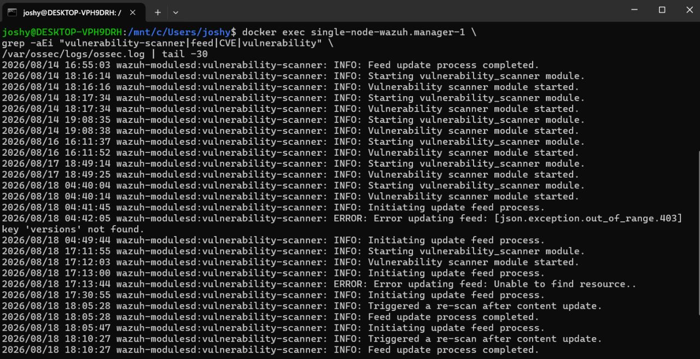
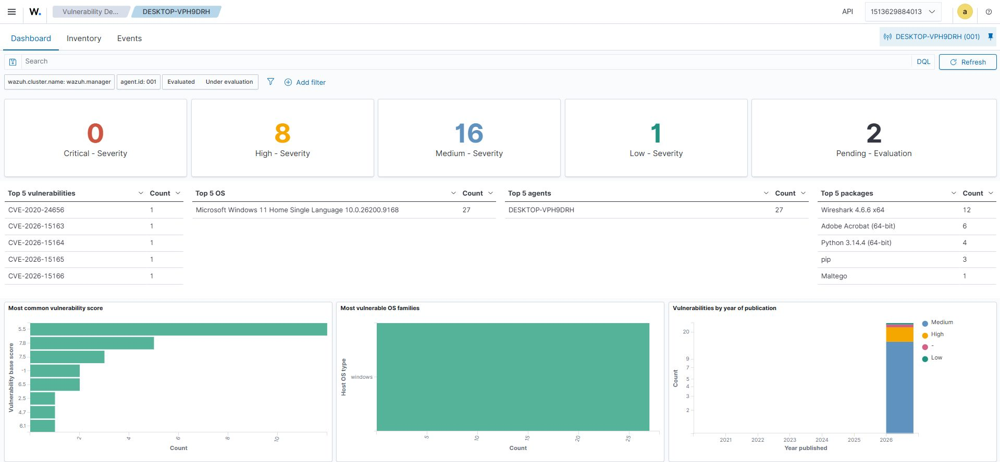
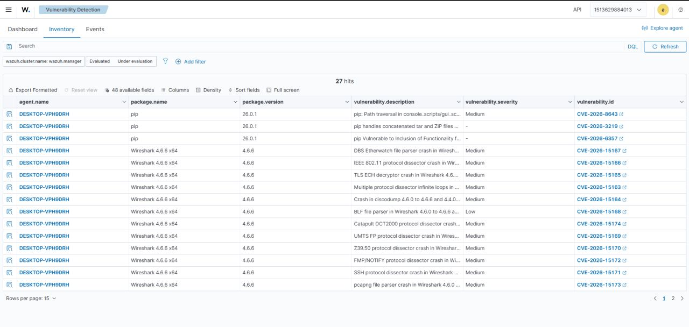

# 🛡️ Lab 3 --- Wazuh Vulnerability Detection

### Identifying Vulnerable Software, Versions and Associated CVEs on a Windows Endpoint


> **Lab objective:** Build practical experience with Wazuh Vulnerability Detection by verifying the vulnerability-scanning pipeline, examining endpoint software inventory, identifying vulnerable packages and versions, and investigating the associated CVEs and severity levels from a SOC analyst perspective.

------------------------------------------------------------------------

## 📌 Overview

Finding vulnerabilities is only useful if you can understand **where they came from and what software they affect**.

In this lab, I worked with **Wazuh Vulnerability Detection** to understand how vulnerability findings are produced from endpoint software and version information.

The practical workflow was:

```text
Windows Endpoint
      ↓
Software / Package Inventory
      ↓
Wazuh Vulnerability Detection
      ↓
Vulnerability Intelligence
      ↓
Software + Version Correlation
      ↓
Applicable CVE Findings
      ↓
Severity / Inventory Investigation
```

The lab focused on understanding how Wazuh moves from an endpoint's installed software inventory to vulnerability findings that can be investigated by a SOC or security analyst.

Wazuh detected **27 vulnerability findings** on the monitored endpoint during the investigation.

The findings included vulnerabilities affecting software such as:

- Wireshark
- pip
- Python
- Adobe Acrobat
- Maltego

The most important lesson was that Wazuh does not simply label an endpoint as "vulnerable." It uses software and version information from the endpoint and correlates that inventory with vulnerability intelligence to identify applicable CVEs.

------------------------------------------------------------------------

## 🎯 Objectives

The main objectives of this lab were to:

- Understand the purpose of vulnerability detection in a SOC environment.
- Verify that the Wazuh vulnerability detection component was operating.
- Examine the monitored Windows endpoint.
- Understand how endpoint software inventory contributes to vulnerability analysis.
- Investigate vulnerability findings in the Wazuh Dashboard.
- Identify affected software and installed versions.
- Review associated CVE identifiers.
- Review vulnerability descriptions.
- Examine vulnerability severity levels.
- Understand how vulnerability intelligence is correlated with endpoint inventory.
- Identify software contributing multiple vulnerability findings.
- Understand the difference between vulnerability discovery and remediation.
- Practice investigating vulnerability data from a security-operations perspective.

------------------------------------------------------------------------

## 🧪 Lab Scenario

A Windows endpoint was monitored by Wazuh for vulnerability assessment.

The investigation focused on:

```text
Endpoint
   ↓
Installed Software
   ↓
Software Version
   ↓
Vulnerability Matching
   ↓
CVE Identification
   ↓
Severity
   ↓
Security Investigation
```

The monitored endpoint shown in the evidence was:

```text
Agent: DESKTOP-VPH9DRH
Agent ID: 001
```

The purpose of the exercise was to understand the vulnerability findings already identified by Wazuh and investigate which installed software and versions were associated with them.

This was performed in a controlled practice environment.

------------------------------------------------------------------------

## 🖥️ Lab Environment

| Component | Role |
|---|---|
| **Wazuh Manager** | Runs and processes vulnerability detection |
| **Wazuh Vulnerability Detection** | Correlates endpoint software inventory with vulnerability intelligence |
| **Wazuh Dashboard** | Used to view vulnerability summaries |
| **Vulnerability Inventory** | Used to inspect affected packages, versions and CVEs |
| **Wazuh Agent** | Provides endpoint inventory information |
| **Windows Endpoint** | Endpoint whose installed software was evaluated |

### High-Level Architecture

```text
┌──────────────────────────────┐
│       Windows Endpoint       │
│                              │
│   Installed Software         │
│   Software Versions          │
└──────────────┬───────────────┘
               │
               │ Endpoint Inventory
               ▼
┌──────────────────────────────┐
│        Wazuh Manager         │
│                              │
│  Vulnerability Detection     │
│  Inventory Processing        │
│  Vulnerability Correlation   │
└──────────────┬───────────────┘
               │
               │ Vulnerability Intelligence
               ▼
┌──────────────────────────────┐
│     CVE / Vulnerability      │
│          Matching            │
│                              │
│  Software + Version + CVE    │
│  Severity / Description      │
└──────────────┬───────────────┘
               │
               ▼
┌──────────────────────────────┐
│       Wazuh Dashboard        │
│                              │
│  Summary / Inventory / CVEs  │
│  Investigation               │
└──────────────────────────────┘
```

------------------------------------------------------------------------

## 🔎 What is Vulnerability Detection?

Vulnerability detection is the process of identifying known security weaknesses that may affect software or systems.

For a SOC or security team, vulnerability visibility helps answer questions such as:

- What software is installed?
- Which versions are running?
- Which known vulnerabilities apply?
- How severe are those vulnerabilities?
- Which endpoints are affected?
- Which software contributes the most findings?
- Which vulnerabilities should be investigated or remediated?

The important point is that vulnerability detection depends heavily on accurate asset and software inventory.

Conceptually:

```text
Software Inventory
        ↓
Software Name
        ↓
Installed Version
        ↓
Vulnerability Intelligence
        ↓
Version / Product Matching
        ↓
Applicable CVE
        ↓
Severity + Description
```

------------------------------------------------------------------------

## ⚙️ Vulnerability Detection Concept

Wazuh uses endpoint inventory information as an important input to vulnerability analysis.

The process can be represented as:

```text
Windows Endpoint
       ↓
Installed Software Detected
       ↓
Software Version Collected
       ↓
Vulnerability Intelligence Evaluated
       ↓
Applicable Vulnerabilities Identified
       ↓
CVE Findings Presented in Wazuh
```

This is different from simply running a generic vulnerability list against every machine.

The findings are connected to software and version information from the endpoint.

------------------------------------------------------------------------

## 🔧 Verifying the Vulnerability Detection Pipeline

Before investigating the findings, I checked the Wazuh vulnerability-scanner activity from the manager environment.



The manager log shows the vulnerability scanner being started and the feed/update process being initiated.

The evidence also shows:

```text
Vulnerability scanner module started.
```

and later:

```text
Triggered a re-scan after content update.
Feed update process completed.
```

The log contains a couple of transient feed-update errors during the recorded period, including:

```text
Error updating feed
```

and:

```text
Unable to find resource.
```

The later entries show the update process completing and a re-scan being triggered.

This was useful because it demonstrated that vulnerability detection is not just a dashboard feature; there is an underlying scanning and vulnerability-intelligence processing workflow.

------------------------------------------------------------------------

## 📊 Evidence --- Vulnerability Detection Dashboard

The first dashboard view provides a high-level summary of the vulnerability findings for the Windows endpoint.



The monitored endpoint shown in the dashboard is:

```text
Agent:     DESKTOP-VPH9DRH
Agent ID:  001
```

The dashboard showed:

```text
Critical:           0
High:               8
Medium:            16
Low:                 1
Pending Evaluation: 2
```

The evaluated findings therefore totaled:

```text
8 + 16 + 1 = 25
```

with an additional:

```text
2 Pending Evaluation
```

for:

```text
27 total findings shown in the dashboard.
```

The dashboard also showed:

```text
Top 5 vulnerabilities
Top 5 OS
Top 5 agents
Top 5 packages
```

This provides an initial overview before moving into the individual vulnerability records.

------------------------------------------------------------------------

## 📦 Affected Software Inventory

The dashboard provided useful information about which packages contributed to the vulnerability findings.

The top packages shown were:

| Package | Findings |
|---|---:|
| Wireshark 4.6.6 x64 | 12 |
| Adobe Acrobat (64-bit) | 6 |
| Python 3.14.4 (64-bit) | 4 |
| pip | 3 |
| Maltego | 1 |

The software distribution is important because a vulnerability count by itself does not explain what needs attention.

For example, the dashboard shows that **Wireshark 4.6.6 x64 accounts for 12 findings** in this assessment.

That immediately gives an analyst a useful direction for further investigation.

------------------------------------------------------------------------

## 🔍 Investigating Vulnerability Inventory

After reviewing the dashboard summary, I moved into the **Inventory** view to examine the individual vulnerability records.



The inventory view showed:

```text
27 hits
```

for the monitored environment.

The table included fields such as:

```text
agent.name
package.name
package.version
vulnerability.description
vulnerability.severity
vulnerability.id
```

This is where the dashboard summary becomes actionable.

Instead of only knowing that vulnerabilities exist, the analyst can identify:

```text
Which endpoint?
       ↓
Which package?
       ↓
Which version?
       ↓
Which vulnerability?
       ↓
What severity?
       ↓
What does the vulnerability description say?
```

------------------------------------------------------------------------

## 🧩 Example --- pip Vulnerability Findings

The inventory contained multiple findings associated with:

```text
Package: pip
Version: 26.0.1
```

Examples visible in the evidence included CVEs such as:

```text
CVE-2026-8643
CVE-2026-3219
CVE-2026-6357
```

The descriptions in the inventory provide additional context about the affected functionality.

This demonstrates why software version information matters.

A vulnerability identifier alone is not enough for endpoint prioritization. The analyst also needs to know which installed software and version is affected.

------------------------------------------------------------------------

## 🧪 Example --- Wireshark Vulnerability Findings

The inventory also contained a larger group of findings associated with:

```text
Package:  Wireshark 4.6.6 x64
Version:  4.6.6
```

The evidence shows multiple CVEs associated with the installed Wireshark version.

Examples visible in the inventory include:

```text
CVE-2026-15167
CVE-2026-15166
CVE-2026-15165
CVE-2026-15163
CVE-2026-15164
CVE-2026-15168
CVE-2026-15174
CVE-2026-15169
CVE-2026-15170
CVE-2026-15172
CVE-2026-15171
CVE-2026-15173
```

Most of the displayed Wireshark findings were marked:

```text
Medium
```

with at least one displayed finding marked:

```text
Low
```

This shows how one installed package can contribute multiple vulnerability findings.

------------------------------------------------------------------------

## 🆔 Understanding CVEs

A **CVE (Common Vulnerabilities and Exposures)** identifier provides a standardized reference for a publicly documented vulnerability.

In the Wazuh inventory, the CVE appears alongside the affected software and version.

For example:

```text
Package
   ↓
Wireshark 4.6.6
   ↓
CVE
   ↓
Vulnerability Description
   ↓
Severity
```

This allows the analyst to connect a vulnerability record to a specific piece of software on a specific endpoint.

The CVE identifier also provides a useful reference point for additional investigation and remediation planning.

------------------------------------------------------------------------

## ⚠️ Understanding Severity

The dashboard categorized findings into severity levels:

```text
Critical
High
Medium
Low
Pending Evaluation
```

In the captured assessment:

```text
Critical:           0
High:               8
Medium:            16
Low:                 1
Pending Evaluation: 2
```

Severity provides an important risk signal, but it should not be treated as the only factor in a security decision.

A security analyst may also need to consider:

- Whether the affected software is actually used.
- Whether the vulnerable functionality is exposed.
- Whether the endpoint is business-critical.
- Whether exploitation is known or observed.
- Whether compensating controls exist.
- Whether a patch or upgrade is available.
- Whether the vulnerability is relevant to the organization's environment.

------------------------------------------------------------------------

## 🕵️ Vulnerability Investigation Workflow

The investigation performed in this lab can be represented as:

```text
1. Identify the endpoint
        ↓
2. Review software inventory
        ↓
3. Identify affected package
        ↓
4. Identify installed version
        ↓
5. Identify CVE
        ↓
6. Review vulnerability description
        ↓
7. Review severity
        ↓
8. Determine whether the software is required
        ↓
9. Check available remediation / upgrade
        ↓
10. Validate after remediation
```

The key point is that vulnerability detection identifies a security condition, while remediation requires understanding the affected asset and software.

------------------------------------------------------------------------

## 📋 Evidence Summary

| Evidence | Observation |
|---|---|
| Wazuh component | Vulnerability Detection |
| Endpoint | `DESKTOP-VPH9DRH` |
| Agent ID | `001` |
| Total findings shown | `27` |
| Critical | `0` |
| High | `8` |
| Medium | `16` |
| Low | `1` |
| Pending Evaluation | `2` |
| Top affected package | Wireshark 4.6.6 x64 |
| Wireshark findings | `12` |
| Adobe Acrobat findings | `6` |
| Python findings | `4` |
| pip findings | `3` |
| Maltego findings | `1` |
| Main investigation view | Vulnerability Detection / Inventory |
| Key fields | Package, version, description, severity, CVE |
| Vulnerability intelligence | Used for software/version correlation |

------------------------------------------------------------------------

## 🧠 What I Learned

This lab changed my understanding of vulnerability management from simply looking for "vulnerable machines" to understanding the relationship between **assets, software versions and vulnerability intelligence**.

The practical flow was:

```text
Endpoint
   ↓
Software Inventory
   ↓
Software Version
   ↓
Vulnerability Correlation
   ↓
CVE Identification
   ↓
Severity
   ↓
Investigation
   ↓
Remediation Planning
```

The most useful lesson was that vulnerability findings are contextual.

A CVE becomes meaningful to the analyst when it can be connected to:

```text
Which endpoint?
       ↓
Which software?
       ↓
Which version?
       ↓
Which vulnerability?
       ↓
How severe?
       ↓
What is the remediation path?
```

------------------------------------------------------------------------

## 🚨 SOC Relevance

Vulnerability data is highly relevant to SOC and Blue Team operations because it provides context about weaknesses present on monitored endpoints.

### Asset and Software Visibility

The inventory allows analysts to understand what software is present on an endpoint.

### Vulnerability Triage

The findings provide a starting point for identifying vulnerabilities that require investigation.

### CVE Investigation

CVE identifiers provide standardized references for researching the underlying vulnerability.

### Risk Context

Severity, affected software and endpoint context can be combined to understand the security significance of a finding.

### Detection and Response Correlation

Vulnerability information can also become useful during incident investigations.

For example:

```text
Vulnerability Found
        ↓
Affected Software Identified
        ↓
Security Event Detected
        ↓
Endpoint Investigation
        ↓
Determine Exposure / Exploitation
```

A vulnerable package can become more important when there is additional evidence that the affected software is being targeted or exploited.

------------------------------------------------------------------------

## 🔗 Vulnerability Detection + Other Security Controls

Vulnerability detection becomes more useful when combined with other security telemetry.

| Data Source | What It Can Add |
|---|---|
| **Vulnerability Detection** | Known weaknesses affecting installed software |
| **Software Inventory** | Package names and installed versions |
| **FIM** | Changes to affected files |
| **Auditd / Endpoint Logs** | Commands and activity on the endpoint |
| **Authentication Logs** | Account activity around the affected system |
| **Network Telemetry** | Connections involving the endpoint |
| **Threat Intelligence** | Context about known indicators and exploitation |
| **SIEM Correlation** | Relationship between vulnerabilities and security events |

This is important because vulnerability management and incident detection are related but different activities.

------------------------------------------------------------------------

## ⚠️ False Positives and Analyst Context

A vulnerability finding does not automatically mean that an endpoint has been compromised.

It indicates that the installed software/version matches vulnerability intelligence.

A SOC or security analyst should therefore distinguish between:

```text
Vulnerable
      ≠
Compromised
```

The finding may require remediation, but additional evidence is needed to determine whether exploitation has actually occurred.

Useful questions include:

```text
Is the affected software installed?
        ↓
Is the reported version accurate?
        ↓
Is the software actively used?
        ↓
Is the vulnerable functionality exposed?
        ↓
Is exploitation known?
        ↓
Are there related security alerts?
        ↓
Has the vulnerability been remediated?
```

This distinction is important when moving from vulnerability management into incident response.

------------------------------------------------------------------------

## 🧩 Detection vs Remediation

### Detection

Wazuh identifies that installed software matches known vulnerability information.

Example:

```text
Wireshark 4.6.6
       ↓
Applicable CVE
       ↓
Vulnerability Finding
```

### Investigation

The analyst examines:

```text
Endpoint
Package
Version
CVE
Description
Severity
Context
```

### Remediation

The responsible team can then determine an appropriate action, such as:

```text
Patch
  ↓
Upgrade
  ↓
Remove
  ↓
Restrict
  ↓
Apply Compensating Control
```

### Validation

After remediation, the endpoint should be reassessed to confirm whether the vulnerability finding has been resolved.

This makes vulnerability management a continuous cycle rather than a one-time scan.

------------------------------------------------------------------------

## 📌 Key Takeaways

### 1. Vulnerability detection depends on inventory

Wazuh needs endpoint software information to determine which vulnerabilities may apply.

### 2. Software version matters

The same application can have different vulnerability exposure depending on the installed version.

### 3. CVEs provide standardized vulnerability references

They allow analysts to identify and research specific known vulnerabilities.

### 4. One package can produce multiple findings

In this assessment, Wireshark accounted for 12 of the displayed findings.

### 5. Severity provides context

The assessment contained high, medium and low findings, along with pending evaluations.

### 6. Vulnerable does not automatically mean compromised

A vulnerability finding indicates exposure to a known weakness, not proof of successful exploitation.

### 7. Vulnerability management requires follow-through

Detection is only the beginning. The affected software needs to be investigated, remediated where appropriate, and validated afterward.

------------------------------------------------------------------------

## 🧪 Lab Outcome

The lab successfully demonstrated the basic vulnerability-detection and investigation cycle:

```text
Windows Endpoint
        ↓
Software Inventory
        ↓
Wazuh Vulnerability Detection
        ↓
Vulnerability Intelligence
        ↓
Software / Version Correlation
        ↓
CVE Findings
        ↓
Severity Analysis
        ↓
Security Investigation
        ↓
Remediation Planning
```

The practical takeaway was:

> **Finding a vulnerability is only the first step. Understanding the affected software, version, exposure and context is what makes the finding useful.**

------------------------------------------------------------------------

## 🔐 Security Note

All activity in this lab was performed in a controlled practice environment for defensive security learning.

The purpose was to understand vulnerability detection, endpoint software inventory, CVE correlation, severity analysis and security-operations investigation.

------------------------------------------------------------------------

## 🔗 Related Work

This lab is **Lab 3** in the Wazuh SOC Labs repository and builds on the endpoint-monitoring and network-monitoring foundations established in the previous labs.

**Previous:** [Lab 2 --- Suricata IDS Logs Through Wazuh](./Lab-2-Suricata-IDS-Wazuh.md)

**Next:** [Lab 4 --- Auditd Linux Endpoint Detection](./Lab-4-Auditd-Linux-Endpoint-Detection.md)

------------------------------------------------------------------------

## 👨‍💻 Author

**Josh Yadav**

------------------------------------------------------------------------

### 🛡️ Detect → Investigate → Understand → Respond
