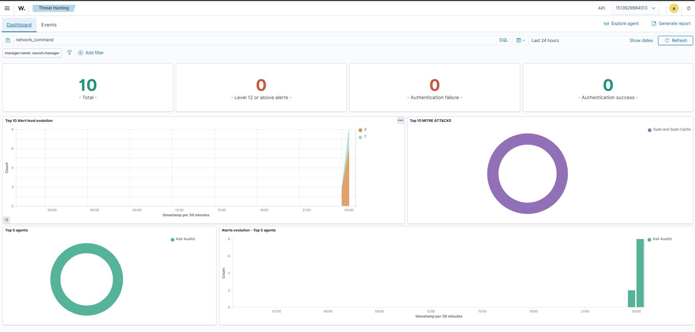
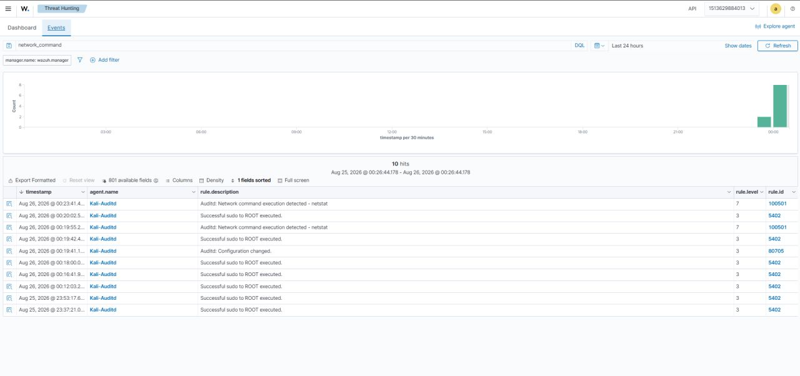
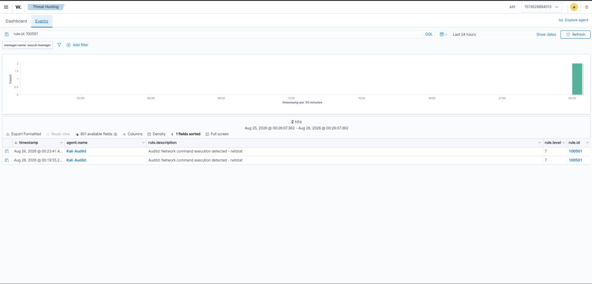

# 🛡️ Lab 4 --- End-to-End Linux Endpoint Detection Using Auditd & Wazuh

### Detecting Network Investigation Commands Through Auditd, Wazuh Decoding and Custom Detection Rules


> **Lab objective:** Build and validate an end-to-end Linux endpoint detection pipeline using Auditd and Wazuh, from command execution on Kali Linux to a custom Wazuh detection rule and analyst investigation.

------------------------------------------------------------------------

## 📌 Overview

**One command can be harmless. Context can make it suspicious.**

In this lab, I built and tested an **end-to-end Linux endpoint detection pipeline using Auditd and Wazuh**.

The goal was to detect the execution of the network investigation command:

```text
netstat
```

and understand how that activity travels through a security monitoring pipeline.

The complete flow was:

```text
netstat executed on Kali Linux
        ↓
Auditd captured the execution
        ↓
Wazuh Agent collected the audit event
        ↓
Wazuh decoded the event
        ↓
Custom detection rule matched the event
        ↓
Wazuh generated a Level 7 alert
        ↓
Alert investigated in Wazuh
```

The lab also included detection validation using `wazuh-logtest` before confirming the real end-to-end alert after executing the command.

------------------------------------------------------------------------

## 🎯 Objectives

The main objectives of this lab were to:

- Understand how Linux Auditd records command execution.
- Monitor command activity on a Linux endpoint.
- Collect Auditd events through the Wazuh Agent.
- Understand the Auditd → Wazuh data flow.
- Create a custom Wazuh detection rule.
- Detect execution of the `netstat` command.
- Validate the detection logic with `wazuh-logtest`.
- Execute the command on the monitored endpoint.
- Confirm the real alert in the Wazuh Dashboard.
- Investigate the resulting event.
- Understand why command context matters during SOC investigations.

------------------------------------------------------------------------

## 🧪 Lab Scenario

A Kali Linux endpoint was monitored using Wazuh.

The objective was to detect a network investigation command rather than treating every command execution as malicious.

The monitored endpoint was:

```text
Agent: Kali-Auditd
```

The detection focused specifically on:

```text
Audit event
    ↓
network_command
    ↓
netstat
    ↓
Custom Wazuh Rule 100501
    ↓
Level 7 Alert
```

This creates a simple but realistic example of **endpoint detection engineering**.

------------------------------------------------------------------------

## 🖥️ Lab Environment

| Component | Role |
|---|---|
| **Kali Linux** | Monitored Linux endpoint |
| **Auditd** | Captures Linux audit events |
| **Wazuh Agent** | Collects endpoint audit telemetry |
| **Wazuh Manager** | Decodes and evaluates events |
| **Custom Wazuh Rule** | Detects the targeted command |
| **Wazuh Dashboard** | Used for alert investigation |
| **wazuh-logtest** | Used to validate detection logic |

### High-Level Architecture

```text
┌──────────────────────────────┐
│        Kali Linux            │
│                              │
│        netstat               │
│          │                   │
│          ▼                   │
│        Auditd                │
└──────────┬───────────────────┘
           │
           │ Audit Event
           ▼
┌──────────────────────────────┐
│        Wazuh Agent           │
│                              │
│   Collects Auditd events     │
└──────────┬───────────────────┘
           │
           ▼
┌──────────────────────────────┐
│       Wazuh Manager          │
│                              │
│   Decoder                    │
│      ↓                       │
│   Custom Rule 100501         │
└──────────┬───────────────────┘
           │
           │ Level 7 Alert
           ▼
┌──────────────────────────────┐
│       Wazuh Dashboard        │
│                              │
│   Detection + Investigation  │
└──────────────────────────────┘
```

------------------------------------------------------------------------

## 🔎 Why Auditd?

Linux Auditd provides security-relevant audit telemetry from Linux systems.

For SOC monitoring, command execution data can help answer questions such as:

- What command was executed?
- When was it executed?
- Which account executed it?
- What process was involved?
- Was the activity successful?
- What other activity occurred around the same time?

This makes Auditd useful as an endpoint telemetry source for security detection.

However, command execution alone does not automatically indicate malicious behavior.

That distinction became an important part of this lab.

------------------------------------------------------------------------

## ⚙️ Detection Logic

The custom detection was designed around the Auditd event fields associated with the network command.

The rule used in the lab was:

```text
Rule ID: 100501
Rule Level: 7
```

The detection matched the Auditd event associated with:

```text
network_command
```

and specifically:

```text
netstat
```

The resulting alert description was:

```text
Auditd: Network command execution detected - netstat
```

Conceptually:

```text
Auditd event
      ↓
audit.key = network_command
      ↓
audit.command = netstat
      ↓
Custom Rule 100501
      ↓
Level 7 Alert
```

This is an example of using **custom detection logic** to turn raw endpoint telemetry into a security-relevant alert.

------------------------------------------------------------------------

## 🧪 Validating the Detection Before Execution

Before relying on the real endpoint event, the detection logic was validated using:

```text
wazuh-logtest
```

This provides a controlled way to test how Wazuh processes an event.

The validation workflow was:

```text
Sample Auditd Event
        ↓
Decoder Processing
        ↓
Rule Evaluation
        ↓
Expected Rule Match
```

This is useful during detection engineering because it allows the analyst to verify the rule logic before generating real activity.

------------------------------------------------------------------------

## 💻 Executing the Network Investigation Command

The actual command used for the lab was:

```bash
netstat
```

`netstat` is a legitimate network investigation and troubleshooting utility.

It can be used to inspect network connections and related information on a Linux system.

The important security lesson is:

```text
netstat
   ≠
automatically malicious
```

The command becomes more interesting to a SOC analyst when considered alongside other evidence.

For example:

```text
netstat
   +
unexpected login
   +
privilege escalation
   +
suspicious process
   +
unexpected outbound connection
```

can provide a much stronger investigation lead than the command by itself.

------------------------------------------------------------------------

## 📊 Evidence --- Wazuh Dashboard

After generating the endpoint activity, the resulting data was visible in the Wazuh Threat Hunting environment.



The dashboard was filtered for:

```text
network_command
```

and showed activity associated with:

```text
Agent: Kali-Auditd
```

The dashboard showed:

```text
10 Total
```

alerts/events in the displayed view.

The alert-level visualization also showed events at Level 3 and Level 7, with the custom detection contributing the Level 7 activity.

This provided a high-level view before moving into the individual event records.

------------------------------------------------------------------------

## 🔍 Investigating the Auditd Events

The next step was to move from the dashboard summary to the event-level view.



The event table showed multiple records associated with the monitored Kali endpoint.

Relevant records included:

```text
Auditd: Network command execution detected - netstat
```

with:

```text
Rule ID: 100501
Rule Level: 7
```

The event list also contained other Auditd-related activity, including successful `sudo` activity and a configuration-change event.

This is important from a SOC perspective because the analyst should not investigate an alert in isolation.

The surrounding events can provide useful context.

For example:

```text
Command execution
      ↓
Authentication / sudo activity
      ↓
Configuration change
      ↓
Additional endpoint activity
```

can help establish what happened around the detection.

------------------------------------------------------------------------

## 🎯 Filtering the Custom Detection Rule

To isolate the custom detection, the investigation was narrowed to:

```text
rule.id: 100501
```



The filtered view showed:

```text
2 hits
```

and both records were associated with:

```text
Agent: Kali-Auditd
```

The alert description was:

```text
Auditd: Network command execution detected - netstat
```

with:

```text
Rule ID: 100501
Rule Level: 7
```

This confirmed that the custom rule was not only valid during testing but also matched real endpoint activity.

------------------------------------------------------------------------

## 🔗 End-to-End Detection Pipeline

The completed detection pipeline can now be represented as:

```text
┌────────────────────────────┐
│      User executes         │
│          netstat            │
└─────────────┬──────────────┘
              │
              ▼
┌────────────────────────────┐
│          Auditd            │
│   Captures command event   │
└─────────────┬──────────────┘
              │
              ▼
┌────────────────────────────┐
│       Wazuh Agent          │
│    Collects audit log      │
└─────────────┬──────────────┘
              │
              ▼
┌────────────────────────────┐
│      Wazuh Decoder         │
│  Extracts Auditd fields    │
└─────────────┬──────────────┘
              │
              ▼
┌────────────────────────────┐
│   Custom Rule 100501       │
│                            │
│ network_command + netstat  │
└─────────────┬──────────────┘
              │
              ▼
┌────────────────────────────┐
│       Level 7 Alert        │
└─────────────┬──────────────┘
              │
              ▼
┌────────────────────────────┐
│     Wazuh Dashboard        │
│      Investigation         │
└────────────────────────────┘
```

This is the core result of the lab.

------------------------------------------------------------------------

## 🕵️ SOC Investigation Thinking

The biggest lesson from this exercise was that **a detection does not automatically mean an attack**.

A SOC analyst should investigate the context surrounding the alert.

Useful questions include:

### Who executed it?

Identify the account associated with the activity.

```text
Who?
 ↓
User / Account
```

### What command was executed?

Determine the exact command that generated the detection.

```text
What?
 ↓
netstat
```

### Was it successful?

Determine whether the command completed successfully and whether the event indicates normal execution.

### What process executed it?

Process information can help establish whether the command came from an expected shell or another process.

### What happened before and after?

Look for:

```text
Authentication
Privilege escalation
Configuration changes
Process execution
Network connections
Other security alerts
```

This surrounding activity can determine whether a benign command deserves additional investigation.

------------------------------------------------------------------------

## 🧠 Why `netstat` Is Interesting to a SOC Analyst

`netstat` is a legitimate administrative and troubleshooting utility.

An administrator may use it to:

- Inspect active network connections.
- Troubleshoot connectivity.
- Investigate listening services.
- Understand network state.

Therefore:

```text
netstat execution
        ↓
Not automatically malicious
```

But during an incident, an unexpected network enumeration command can become relevant.

For example:

```text
Unexpected login
       ↓
Privilege escalation
       ↓
netstat
       ↓
Network reconnaissance
       ↓
Additional suspicious activity
```

In that context, the command may become an important investigation lead.

The key is **correlation and context**, not treating a single command as proof of compromise.

------------------------------------------------------------------------

## 📋 Evidence Summary

| Evidence | Observation |
|---|---|
| Endpoint | `Kali-Auditd` |
| Detection source | Linux Auditd |
| Command monitored | `netstat` |
| Detection category | `network_command` |
| Custom rule | `100501` |
| Custom rule level | `7` |
| Alert description | `Auditd: Network command execution detected - netstat` |
| Filtered rule hits | `2` |
| Dashboard events shown | `10` |
| Validation tool | `wazuh-logtest` |
| SIEM | Wazuh |
| Investigation view | Threat Hunting / Events |

------------------------------------------------------------------------

## 🔬 Detection Engineering Workflow

This lab followed a practical detection-engineering cycle:

```text
1. Identify useful endpoint activity
        ↓
2. Capture the activity with Auditd
        ↓
3. Collect the event through Wazuh
        ↓
4. Understand the decoded fields
        ↓
5. Create detection logic
        ↓
6. Test the rule with wazuh-logtest
        ↓
7. Generate real endpoint activity
        ↓
8. Confirm the alert
        ↓
9. Filter and investigate the detection
        ↓
10. Evaluate the surrounding context
```

This is different from simply creating a rule and assuming that it works.

The detection was tested both **before and after real activity was generated**.

------------------------------------------------------------------------

## ⚠️ Detection Does Not Equal Compromise

A Level 7 Wazuh alert indicates that the configured detection logic matched the observed event.

It does not independently prove that an attack occurred.

The analyst still needs to determine:

```text
Alert
 ↓
Context
 ↓
User
 ↓
Process
 ↓
Authentication
 ↓
Network Activity
 ↓
Related Events
 ↓
Investigation Conclusion
```

This distinction is fundamental to SOC work.

A good detection identifies something worth examining.

It does not replace the investigation.

------------------------------------------------------------------------

## 🧩 Detection vs Investigation

### Detection

The custom rule answers:

> **Did the monitored Auditd event match the condition I defined?**

In this lab:

```text
network_command
+
netstat
        ↓
Rule 100501
        ↓
Level 7
```

### Investigation

The analyst then asks:

> **Why did this happen, who performed it, and what else was happening around it?**

That requires additional context.

### Response

Only after sufficient investigation should a response decision be considered.

This can involve:

```text
Validate
   ↓
Investigate
   ↓
Correlate
   ↓
Determine risk
   ↓
Respond if necessary
```

------------------------------------------------------------------------

## 🧠 What I Learned

This lab helped me understand how a raw Linux command can travel through a complete security-monitoring pipeline.

The practical chain was:

```text
Command Execution
       ↓
Auditd Telemetry
       ↓
Wazuh Collection
       ↓
Decoding
       ↓
Custom Detection Rule
       ↓
Security Alert
       ↓
SOC Investigation
```

The most important takeaway was:

> **A detection doesn't automatically mean an attack. Context determines how an analyst should interpret the event.**

`netstat` can be completely legitimate.

The security value comes from being able to detect it, investigate it, and correlate it with other activity when the surrounding context makes it relevant.

------------------------------------------------------------------------

## 🚨 SOC Relevance

This lab demonstrates several practical SOC capabilities:

### Endpoint Telemetry

Using Auditd to collect Linux security-relevant activity.

### Detection Engineering

Creating a custom Wazuh rule based on specific event fields.

### Detection Validation

Testing detection logic with `wazuh-logtest` before relying on real activity.

### Alert Triage

Moving from a dashboard-level signal to individual events.

### Event Correlation

Considering authentication, privilege escalation, configuration changes and other endpoint activity around a detection.

### Analyst Context

Understanding that a single command should not automatically be classified as malicious.

------------------------------------------------------------------------

## 📌 Key Takeaways

### 1. Auditd provides valuable Linux endpoint telemetry

It can capture command execution and other security-relevant activity.

### 2. Wazuh turns raw telemetry into detections

The Wazuh Agent collects the event and the Manager evaluates it using decoders and rules.

### 3. Custom rules make detections more specific

Rule `100501` was created to identify the targeted `netstat` network-command activity.

### 4. Detection validation matters

`wazuh-logtest` provided a controlled way to validate the detection logic before confirming real activity.

### 5. A Level 7 alert is a detection signal, not proof of compromise

The alert must be investigated in context.

### 6. Legitimate commands can become useful investigation leads

`netstat` is a normal administrative tool, but unexpected execution combined with other suspicious activity can become important.

### 7. SOC analysis depends on context

The analyst should ask:

```text
Who?
What?
When?
How?
What happened before?
What happened after?
```

------------------------------------------------------------------------

## 🧪 Lab Outcome

The lab successfully demonstrated an end-to-end Linux endpoint detection pipeline:

```text
Kali Linux
    ↓
Auditd
    ↓
Wazuh Agent
    ↓
Wazuh Decoder
    ↓
Custom Rule 100501
    ↓
Level 7 Alert
    ↓
Wazuh Threat Hunting
    ↓
SOC Investigation
```

The practical outcome was not simply detecting `netstat`.

It was understanding how to take **raw endpoint telemetry**, turn it into a **specific detection**, validate that detection, and then investigate the resulting alert with the surrounding context.

------------------------------------------------------------------------

## 🔐 Security Note

All activity in this lab was performed in a controlled practice environment for defensive security learning.

The purpose was to understand Linux Auditd telemetry, Wazuh detection engineering, alert validation and SOC investigation methodology.

------------------------------------------------------------------------

## 🔗 Related Work

This lab is **Lab 4** in the Wazuh SOC Labs repository and builds on the endpoint monitoring, network monitoring and vulnerability-management concepts covered in the previous labs.

**Previous:** [Lab 3 --- Wazuh Vulnerability Detection](./Lab-3-Vulnerability-Detection.md)

**Next:** [Lab 5 --- SSH Brute Force Detection & Automated Response](./Lab-5-SSH-Brute-Force-Automated-Response.md)

------------------------------------------------------------------------

## 👨‍💻 Author

**Josh Yadav**

------------------------------------------------------------------------

### 🛡️ Detect → Validate → Investigate → Respond
