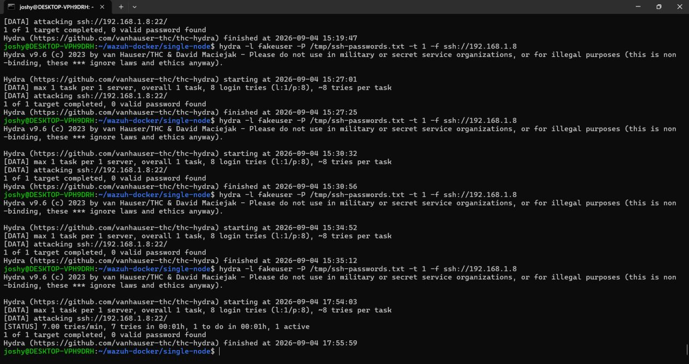
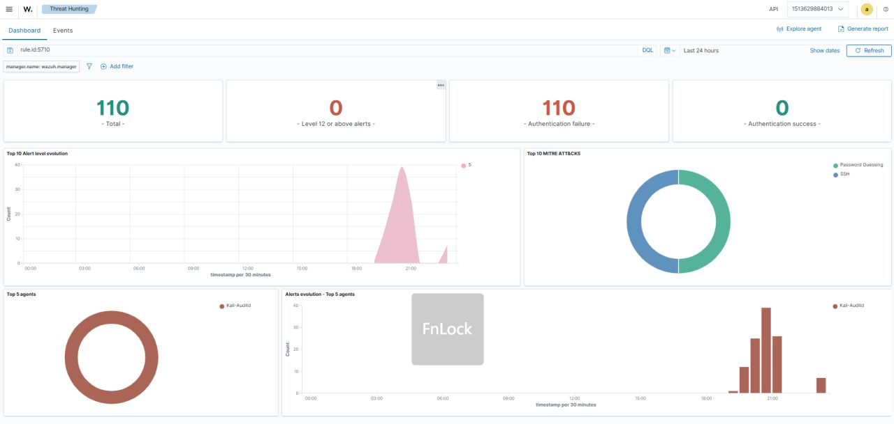
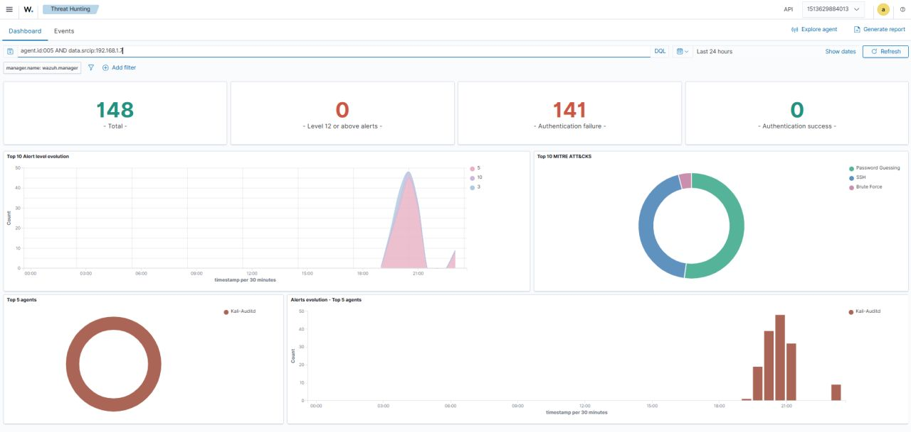
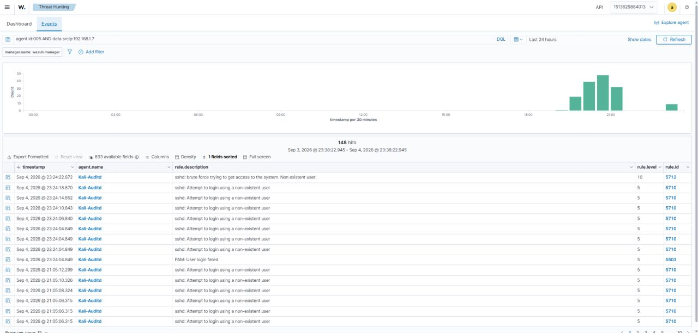

# 🛡️ Lab 5 — SSH Brute Force Detection & Automated Response

### Detecting Repeated SSH Authentication Failures and Automatically Blocking the Source


> **Lab objective:** Simulate SSH brute-force activity, detect the repeated authentication failures with Wazuh, correlate the activity into a higher-severity detection, and automatically block the attacking source IP.

------------------------------------------------------------------------

## 📌 Overview

**One failed login is just an event. Repeated failures can tell a much bigger story.**

In this lab, I built and tested an **SSH Brute Force Detection & Automated Response workflow using Wazuh**.

The goal was to simulate an attack and see whether Wazuh could:

- Detect repeated SSH authentication failures.
- Correlate the activity into a brute-force detection.
- Map the behavior to MITRE ATT&CK.
- Trigger an automated response.
- Block the attacking source IP.
- Remove the temporary block after the configured timeout.

The complete flow was:

```text
SSH Brute Force Simulation
          ↓
Repeated SSH Authentication Failures
          ↓
Wazuh Rule 5710
          ↓
Wazuh Rule 5712 Correlation
          ↓
MITRE ATT&CK T1110
          ↓
Active Response
          ↓
Source IP Blocked
          ↓
180-Second Timeout
          ↓
Automatic Recovery
```

------------------------------------------------------------------------

## 🎯 Objectives

The main objectives of this lab were to:

- Simulate SSH brute-force activity using Hydra.
- Generate repeated SSH authentication failures.
- Analyze the resulting SSH events in Wazuh.
- Understand Wazuh Rule `5710`.
- Understand Wazuh Rule `5712`.
- Understand how repeated failures are correlated.
- Map the detection to MITRE ATT&CK `T1110`.
- Configure Wazuh Active Response.
- Automatically block the attacking IP using `iptables`.
- Validate that the block was applied.
- Verify automatic recovery after the configured timeout.
- Investigate the complete attack → detection → response workflow.

------------------------------------------------------------------------

## 🧪 Lab Scenario

A Kali Linux endpoint was monitored by Wazuh.

The attacking source was the Windows/WSL environment, while the monitored SSH service was running on the Kali endpoint.

The attack simulation generated repeated login attempts against:

```text
SSH
22/tcp
```

The monitored Wazuh endpoint was:

```text
Agent: Kali-Auditd
Agent ID: 005
```

The attacking source IP observed in the Wazuh investigation was:

```text
192.168.1.7
```

The lab therefore represented a simple internal-network brute-force scenario:

```text
Attacker
192.168.1.7
     │
     │ Repeated SSH login attempts
     ▼
Kali Linux
192.168.1.8
     │
     ▼
Wazuh Agent
     │
     ▼
Wazuh Manager
     │
     ├── Rule 5710
     │
     └── Rule 5712
             │
             ▼
       Active Response
             │
             ▼
      iptables DROP
```

------------------------------------------------------------------------

## 🖥️ Lab Environment

| Component | Role |
|---|---|
| **Kali Linux** | Monitored SSH endpoint |
| **Hydra** | Controlled brute-force simulation |
| **OpenSSH** | Target authentication service |
| **Wazuh Agent** | Collects endpoint telemetry |
| **Wazuh Manager** | Detection and correlation |
| **Wazuh Dashboard** | Alert investigation |
| **iptables** | Host-level IP blocking |
| **Active Response** | Automated containment |

------------------------------------------------------------------------

## ⚔️ Simulating the SSH Brute Force

The attack simulation was performed using Hydra in the controlled lab environment.

The test generated repeated SSH login attempts against the Kali endpoint.



The terminal output shows repeated Hydra runs targeting:

```text
ssh://192.168.1.8
```

with multiple login attempts.

The purpose of the activity was not to obtain access, but to generate realistic authentication-failure telemetry that could be detected and investigated by Wazuh.

------------------------------------------------------------------------

## 🔎 Understanding Rule 5710

The first important Wazuh detection was:

```text
Rule ID: 5710
```

Its event description was:

```text
sshd: Attempt to login using a non-existent user.
```

These events represent individual SSH authentication failures.

The important point is that an individual authentication failure does not automatically mean that a brute-force attack is occurring.

For example:

```text
1 failed login
        ↓
Authentication failure
```

could simply be a user entering an incorrect username.

The investigation becomes more interesting when the same source repeatedly generates authentication failures.

------------------------------------------------------------------------

## 📊 Evidence — SSH Authentication Failure Detection

The Wazuh dashboard was filtered around Rule `5710`.



The dashboard showed:

```text
110 Total
110 Authentication failures
0 Authentication successes
```

The visualization also showed the SSH-related activity over time.

This provided the first indication that the endpoint was receiving a significant number of authentication failures.

------------------------------------------------------------------------

## 🔗 Source-Based Investigation

The next step was to investigate the source of the authentication failures.

The Wazuh investigation was narrowed using the endpoint and source IP:

```text
agent.id:005
AND
data.srcip:192.168.1.7
```



The filtered dashboard showed:

```text
148 Total
141 Authentication failures
```

and the MITRE ATT&CK visualization included:

```text
Password Guessing
SSH
Brute Force
```

This helped connect the repeated authentication failures to a specific source rather than treating the events as unrelated login failures.

------------------------------------------------------------------------

## 🧠 Why Correlation Matters

Wazuh does not need to treat every failed authentication as a brute-force attack.

The important concept in this lab was **correlation**.

The detection logic was:

```text
Individual SSH failures
        ↓
Rule 5710
        ↓
Repeated failures from the same activity
        ↓
Rule 5712
        ↓
Brute-force detection
```

This allows the SIEM to distinguish between:

```text
Occasional failed login
```

and:

```text
Repeated authentication failures
```

The second pattern is much more relevant for brute-force detection.

------------------------------------------------------------------------

## 🚨 Rule 5712 — Brute Force Detection

The higher-level detection observed during the investigation was:

```text
Rule ID: 5712
```

with the description:

```text
sshd: brute force trying to get access to the system. Non existent user.
```

The rule correlated the repeated SSH authentication failures and raised the activity to a brute-force detection.

The dashboard showed the event at:

```text
Rule Level: 10
```

and the activity was associated with:

```text
MITRE ATT&CK: T1110
```

------------------------------------------------------------------------

## 🔍 Evidence — Event-Level Investigation

The event-level investigation provided a more detailed view of the activity.



The event list contained repeated records from:

```text
Agent: Kali-Auditd
```

The relevant records included:

```text
sshd: brute force trying to get access to the system. Non existent user.
```

with:

```text
Rule ID: 5712
Rule Level: 10
```

alongside the underlying Rule `5710` authentication-failure events.

This is where the difference between an **event** and a **correlated detection** becomes visible.

------------------------------------------------------------------------

## 🗺️ MITRE ATT&CK Mapping

The brute-force behavior was mapped to:

```text
T1110 — Brute Force
```

The Wazuh dashboard also showed the relevant brute-force/credential-access context.

The relationship can be summarized as:

```text
Repeated authentication attempts
            ↓
Password guessing behavior
            ↓
Brute Force
            ↓
MITRE ATT&CK T1110
```

MITRE ATT&CK mapping provides a common language for describing adversary behavior and helps SOC analysts understand where a detection fits within a larger attack technique framework.

------------------------------------------------------------------------

## 🛡️ Active Response

Detection was only one part of the lab.

The next objective was to automatically respond to the detected source.

Wazuh Active Response was configured to use:

```text
firewall-drop
```

The response was configured with a temporary timeout of:

```text
180 seconds
```

The intended workflow was:

```text
Brute Force Detection
        ↓
Active Response Triggered
        ↓
Source IP Identified
        ↓
iptables DROP Rule Added
        ↓
Attacker Traffic Blocked
```

This moves the lab from passive monitoring into **automated containment**.

------------------------------------------------------------------------

## 🔥 Automated IP Blocking

The attacking source identified during the investigation was:

```text
192.168.1.7
```

When the active response was triggered, the source IP was added to the Kali host's firewall rules using `iptables`.

Conceptually:

```text
192.168.1.7
      ↓
iptables
      ↓
DROP
      ↓
SSH traffic blocked
```

This demonstrates how a SIEM can be connected to a host-level response mechanism.

------------------------------------------------------------------------

## ⏱️ Automatic Recovery

The block was intentionally temporary.

The configured timeout was:

```text
180 seconds
```

After the timeout expired, the response removed the corresponding firewall rule.

The complete response cycle was therefore:

```text
Detection
   ↓
Block
   ↓
180-second timeout
   ↓
Firewall rule removed
   ↓
Normal connectivity restored
```

This is useful in a lab because it demonstrates both **containment** and **recovery**, rather than creating a permanent firewall change.

------------------------------------------------------------------------

## 🔗 Complete Attack-to-Response Pipeline

The complete workflow demonstrated in this lab was:

```text
┌───────────────────────────────┐
│     Hydra SSH Simulation      │
│                               │
│ Repeated authentication tries │
└───────────────┬───────────────┘
                │
                ▼
┌───────────────────────────────┐
│       Kali SSH Service        │
│                               │
│ Authentication failures       │
└───────────────┬───────────────┘
                │
                ▼
┌───────────────────────────────┐
│        Wazuh Agent            │
│                               │
│ Collects SSH telemetry        │
└───────────────┬───────────────┘
                │
                ▼
┌───────────────────────────────┐
│       Wazuh Manager           │
│                               │
│ Rule 5710                     │
│       ↓                       │
│ Rule 5712                     │
└───────────────┬───────────────┘
                │
                ▼
┌───────────────────────────────┐
│     MITRE ATT&CK T1110        │
│         Brute Force           │
└───────────────┬───────────────┘
                │
                ▼
┌───────────────────────────────┐
│       Active Response         │
│                               │
│      firewall-drop            │
└───────────────┬───────────────┘
                │
                ▼
┌───────────────────────────────┐
│          iptables             │
│                               │
│     Source IP → DROP          │
└───────────────┬───────────────┘
                │
                ▼
┌───────────────────────────────┐
│       180-second timeout      │
│                               │
│      Automatic recovery       │
└───────────────────────────────┘
```

------------------------------------------------------------------------

## 🧠 What I Learned

The most important lesson from this lab was that **one failed login is not enough to establish a brute-force attack**.

The useful signal came from the pattern:

```text
Repeated failures
        +
Same source
        +
Authentication context
        ↓
Brute-force detection
```

I also learned how a SIEM can move beyond detection into response:

```text
Detect
  ↓
Correlate
  ↓
Investigate
  ↓
Contain
  ↓
Recover
```

That made this lab different from simply generating and viewing alerts.

------------------------------------------------------------------------

## 🕵️ SOC Investigation Thinking

During a real investigation, an analyst would still need to ask:

### Who was being targeted?

Identify the usernames involved and determine whether they correspond to real accounts or invalid users.

### Where did the attempts originate?

Investigate the source IP and whether it belongs to:

- An internal host
- A known administrator
- A workstation
- A suspicious endpoint
- An external address

### How frequent were the attempts?

Repeated attempts over a short period are more meaningful than isolated failures.

### Did authentication ever succeed?

A successful login following repeated failures can significantly change the investigation priority.

### What happened after the attempts?

Look for:

```text
Successful login
Privilege escalation
Command execution
Persistence
Network reconnaissance
Other endpoint alerts
```

### Was the automated response appropriate?

Automated blocking should be validated against the environment because legitimate users can also trigger authentication failures.

------------------------------------------------------------------------

## 📋 Evidence Summary

| Evidence | Observation |
|---|---|
| Monitored endpoint | `Kali-Auditd` |
| Agent ID | `005` |
| SSH target | `192.168.1.8` |
| Observed source IP | `192.168.1.7` |
| Attack simulation | Hydra |
| Initial rule | `5710` |
| Correlated rule | `5712` |
| Brute-force technique | `T1110` |
| Initial event level | `5` |
| Correlated alert level | `10` |
| Response mechanism | Wazuh Active Response |
| Firewall mechanism | `iptables` |
| Response action | `DROP` |
| Timeout | `180 seconds` |
| Recovery | Automatic firewall-rule removal |

------------------------------------------------------------------------

## 🔬 Detection & Response Workflow

This lab followed a practical SOC workflow:

```text
1. Generate controlled attack activity
        ↓
2. Collect authentication telemetry
        ↓
3. Identify individual failed-login events
        ↓
4. Correlate repeated failures
        ↓
5. Generate brute-force detection
        ↓
6. Map behavior to MITRE ATT&CK
        ↓
7. Trigger Active Response
        ↓
8. Block the source IP
        ↓
9. Maintain temporary containment
        ↓
10. Automatically recover
```

The workflow demonstrates how detection and response can be connected rather than treated as separate systems.

------------------------------------------------------------------------

## ⚠️ Detection Does Not Mean the Investigation Is Finished

Even when Wazuh identifies a brute-force pattern, the analyst should still validate the context.

For example:

```text
Brute-force alert
      ↓
Check source IP
      ↓
Check targeted account
      ↓
Check successful authentications
      ↓
Check endpoint activity
      ↓
Check related alerts
      ↓
Determine impact
```

An automated block can reduce immediate risk, but it does not replace investigation.

------------------------------------------------------------------------

## 🧩 Detection vs Response

### Detection

Wazuh identifies the repeated authentication pattern:

```text
Rule 5710
    ↓
Repeated failures
    ↓
Rule 5712
```

### Response

Wazuh Active Response then performs:

```text
Rule 5712
    ↓
firewall-drop
    ↓
iptables
    ↓
Source IP blocked
```

### Recovery

The temporary response expires:

```text
180 seconds
    ↓
Firewall rule removed
    ↓
Connectivity restored
```

This creates a complete:

```text
Detection → Response → Recovery
```

cycle.

------------------------------------------------------------------------

## 🚨 SOC Relevance

This lab demonstrates practical SOC capabilities including:

### SIEM Monitoring

Analyzing SSH authentication events in Wazuh.

### Detection Engineering

Understanding how individual authentication failures can be correlated into a higher-level detection.

### Threat Detection

Identifying brute-force behavior using repeated authentication failures.

### MITRE ATT&CK

Mapping the activity to `T1110 — Brute Force`.

### Alert Triage

Moving from dashboard-level metrics to source-specific and event-level investigation.

### Automated Response

Using Wazuh Active Response to trigger host-level containment.

### Incident Response

Demonstrating the full lifecycle from detection to temporary containment and recovery.

------------------------------------------------------------------------

## 📌 Key Takeaways

### 1. Individual failures and brute-force activity are different signals

A single failed login does not provide the same evidence as repeated failures from the same source.

### 2. Correlation makes the detection more meaningful

Wazuh Rule `5712` provided the higher-level brute-force detection after repeated authentication failures.

### 3. Source investigation matters

Filtering on the observed source IP helped connect multiple authentication events into one activity pattern.

### 4. MITRE ATT&CK provides useful behavioral context

The activity was associated with:

```text
T1110 — Brute Force
```

### 5. Detection can trigger automated containment

Wazuh Active Response connected the detection to an `iptables` block.

### 6. Automated response should be controlled

The 180-second timeout demonstrated temporary containment rather than a permanent firewall change.

### 7. Recovery is part of the workflow

A complete response process should consider what happens after containment.

------------------------------------------------------------------------

## 🧪 Lab Outcome

The lab successfully demonstrated:

```text
SSH Brute Force Simulation
        ↓
Authentication Failure Detection
        ↓
Rule 5710
        ↓
Rule 5712 Correlation
        ↓
MITRE ATT&CK T1110
        ↓
Active Response
        ↓
iptables DROP
        ↓
180-Second Timeout
        ↓
Automatic Recovery
```

The key outcome was understanding how Wazuh can connect **SIEM detection with automated endpoint response**.

------------------------------------------------------------------------

## 🔐 Security Note

All attack simulation and response testing in this lab was performed in a controlled environment for defensive security learning.

Hydra was used only to generate controlled SSH authentication-failure telemetry against the lab endpoint.

------------------------------------------------------------------------

## 🔗 Related Work

This lab is **Lab 5** in the Wazuh SOC Labs repository and builds on the endpoint monitoring, network monitoring, vulnerability detection and Auditd detection concepts covered in the previous labs.

**Previous:** [Lab 4 — End-to-End Linux Endpoint Detection Using Auditd & Wazuh](./Lab-4-Auditd-Linux-Endpoint-Detection.md)

**Next:** [Lab 6 — FIM + VirusTotal Malware Detection](./Lab-6-FIM-VirusTotal-Malware-Detection.md)

------------------------------------------------------------------------

## 👨‍💻 Author

**Josh Yadav**

------------------------------------------------------------------------

### 🛡️ Detect → Correlate → Investigate → Respond → Recover
