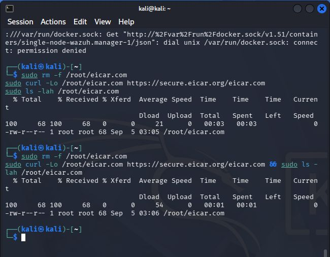
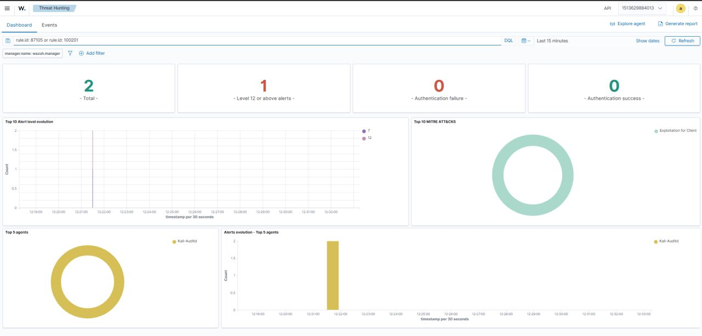
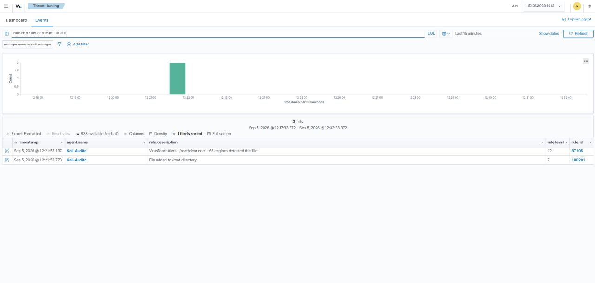
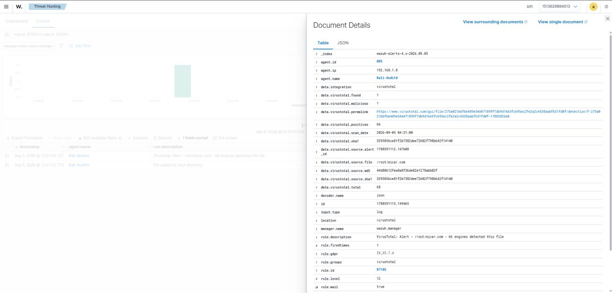
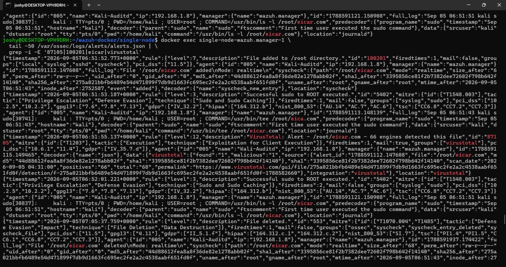

# 🛡️ Lab 6 — FIM + VirusTotal Malware Detection

### Turning a File Integrity Event into a Threat-Intelligence-Enriched Security Alert


> **Lab objective:** Detect a newly created file with Wazuh FIM, enrich the file hash with VirusTotal threat intelligence, and investigate the resulting high-severity alert.

------------------------------------------------------------------------

## 📌 Overview

**What if a newly created file could trigger its own investigation?**

That was the idea behind this lab.

I built a **File Integrity Monitoring + VirusTotal malware detection pipeline** to understand how a SOC can move from a basic file event to a threat-intelligence-enriched security alert.

The test used the harmless **EICAR test file** on a Kali Linux endpoint.

The complete workflow was:

```text
EICAR test file created
        ↓
Wazuh FIM detects the file in real time
        ↓
Custom Rule 100201 triggers
        ↓
File metadata and hash are collected
        ↓
VirusTotal checks the file hash
        ↓
VirusTotal returns 66/68 detections
        ↓
Wazuh Rule 87105 generates a Level 12 alert
        ↓
SOC investigation
```

The important idea was that the original file event by itself was only an observation. External threat intelligence added context that made the event significantly more actionable.

------------------------------------------------------------------------

## 🎯 Objectives

The main objectives of this lab were to:

- Configure Wazuh FIM to monitor the `/root` directory in real time.
- Generate controlled file activity using the EICAR test file.
- Detect the file creation event in Wazuh.
- Create a custom Wazuh rule for files added under `/root`.
- Extract file hashes from the FIM event.
- Integrate Wazuh with VirusTotal.
- Enrich the file event with external threat intelligence.
- Investigate the resulting VirusTotal alert.
- Understand the relationship between FIM, detection rules, threat intelligence and SOC triage.

------------------------------------------------------------------------

## 🧪 Lab Scenario

A Kali Linux endpoint was monitored by Wazuh.

The monitored endpoint was:

```text
Agent: Kali-Auditd
Agent ID: 005
IP: 192.168.1.8
```

The directory selected for real-time monitoring was:

```text
/root
```

The test file used for the lab was:

```text
/root/eicar.com
```

The EICAR test file is specifically designed to safely trigger antivirus and malware-detection mechanisms without being actual malware.

This made it suitable for testing the complete detection and enrichment workflow without introducing real malicious software into the environment.

------------------------------------------------------------------------

## 🖥️ Lab Environment

| Component | Role |
|---|---|
| **Kali Linux** | Monitored endpoint |
| **Wazuh Agent** | Collects FIM telemetry |
| **Wazuh Manager** | Detection, correlation and integration |
| **Wazuh Dashboard** | Investigation and alert visualization |
| **Wazuh FIM** | Detects file activity |
| **Custom Rule 100201** | Detects files added under `/root` |
| **VirusTotal** | External threat-intelligence enrichment |
| **EICAR test file** | Safe malware-detection test artifact |

------------------------------------------------------------------------

## 🏗️ Detection Architecture

The lab connected endpoint monitoring with external threat intelligence:

```text
┌───────────────────────────────┐
│        Kali Linux             │
│                               │
│     /root/eicar.com created   │
└───────────────┬───────────────┘
                │
                ▼
┌───────────────────────────────┐
│          Wazuh FIM            │
│                               │
│ Real-time file activity       │
│ Hash collection               │
└───────────────┬───────────────┘
                │
                ▼
┌───────────────────────────────┐
│       Custom Rule 100201      │
│                               │
│ File added to /root           │
└───────────────┬───────────────┘
                │
                ▼
┌───────────────────────────────┐
│        VirusTotal API         │
│                               │
│ Hash-based threat intelligence│
└───────────────┬───────────────┘
                │
                ▼
┌───────────────────────────────┐
│        Wazuh Rule 87105       │
│                               │
│ VirusTotal malware alert      │
│ Level 12                      │
└───────────────┬───────────────┘
                │
                ▼
┌───────────────────────────────┐
│       SOC Investigation        │
│                               │
│ File + Hash + Intelligence    │
└───────────────────────────────┘
```

------------------------------------------------------------------------

## ⚙️ Configuring Real-Time FIM

The Kali endpoint was configured to monitor `/root` using real-time FIM:

```xml
<directories realtime="yes">/root</directories>
```

This allowed Wazuh to detect file activity as it occurred rather than relying only on periodic scans.

The purpose was to create a focused test environment where file creation under `/root` could be observed immediately.

------------------------------------------------------------------------

## 🧩 Custom Detection Rule

A custom Wazuh rule was created to identify files added under `/root`:

```xml
<rule id="100201" level="7">
  <if_sid>554</if_sid>
  <field name="file">^/root/</field>
  <description>File added to /root directory.</description>
  <group>syscheck,pci_dss_11.5,</group>
</rule>
```

The rule builds on Wazuh's existing FIM event and narrows the detection to files added within the monitored `/root` directory.

The resulting event was:

```text
Rule ID: 100201
Rule Level: 7
Description: File added to /root directory.
```

This became the trigger for the VirusTotal integration.

------------------------------------------------------------------------

## 🧪 Creating the EICAR Test File

The controlled test was performed directly on Kali Linux.



The terminal shows the EICAR test file being downloaded to:

```text
/root/eicar.com
```

and then verified with:

```text
ls -lah /root/eicar.com
```

The file size was:

```text
68 bytes
```

The test file was intentionally used instead of real malware so the detection pipeline could be validated safely.

------------------------------------------------------------------------

## 🔍 FIM Detects the File

Once the file was created, Wazuh FIM generated a file-added event.

The initial event contained information including:

```text
File: /root/eicar.com
Event: added
Mode: realtime
```

The FIM event also provided file hashes that could be used for threat-intelligence lookup.

The important transition was:

```text
File activity
      ↓
FIM telemetry
      ↓
Custom Rule 100201
```

At this stage, Wazuh had detected file activity but had not yet established the threat context provided by VirusTotal.

------------------------------------------------------------------------

## 📊 Evidence — Wazuh Threat Hunting

The Wazuh dashboard was filtered for the relevant FIM and VirusTotal rules.



The dashboard showed two relevant events:

```text
Rule 100201
File added to /root directory.
```

and:

```text
Rule 87105
VirusTotal: Alert - /root/eicar.com - 66 engines detected this file
```

The dashboard also showed the VirusTotal alert at:

```text
Level 12
```

This demonstrated the complete transition from a file-integrity event to a threat-intelligence-enriched security alert.

------------------------------------------------------------------------

## 🔎 Evidence — Event-Level Investigation

The event view provided the individual records generated during the test.



The two relevant events were:

```text
Rule ID: 100201
File added to /root directory.
```

followed by:

```text
Rule ID: 87105
VirusTotal: Alert - /root/eicar.com - 66 engines detected this file
```

The investigation therefore showed the relationship between:

```text
FIM Detection
      ↓
Threat Intelligence Enrichment
      ↓
Malware Detection Alert
```

------------------------------------------------------------------------

## 🧬 VirusTotal Threat Intelligence

The most important part of the enrichment stage was the file hash.

Wazuh used the hash associated with the FIM event to query VirusTotal rather than uploading the file itself for this workflow.

The VirusTotal result returned:

```text
66 positives
68 total engines
```

or:

```text
66 / 68 security engines
```

This resulted in Wazuh Rule:

```text
87105
```

with:

```text
Level: 12
```

and the description:

```text
VirusTotal: Alert - /root/eicar.com - 66 engines detected this file
```

------------------------------------------------------------------------

## 🔬 Evidence — VirusTotal Alert Details

The individual alert document provided the underlying enrichment fields.



The document showed fields including:

```text
agent.id: 005
agent.name: Kali-Auditd
agent.ip: 192.168.1.8

data.virustotal.found: 1
data.virustotal.malicious: 1
data.virustotal.positives: 66
data.virustotal.total: 68

data.virustotal.source.file: /root/eicar.com
```

The event also contained the VirusTotal-related file hashes and integration metadata.

This is useful during SOC investigation because the analyst can move from a generic alert to the actual file and its identifying hash values.

------------------------------------------------------------------------

## 🧾 File Hash Evidence

The FIM event contained the file hashes associated with `/root/eicar.com`.

The observed values included:

```text
MD5:
44d88612fea8a8f36de82e1278abb02f

SHA1:
3395856ce81f2b7382dee72602f798b642f14140

SHA256:
275a021bbfb6489e54d471899f7db9d1663fc695ec2fe2a2c4538aabf651fd0f
```

These hashes provide stable identifiers that can be used during threat-intelligence investigation.

------------------------------------------------------------------------

## 📜 Evidence — Raw Wazuh Alert Data

The manager-side alert data showed the FIM event and the VirusTotal enrichment.



The relevant records included:

```text
Rule 100201
File added to /root directory.
```

and:

```text
Rule 87105
VirusTotal: Alert - /root/eicar.com - 66 engines detected this file
```

The JSON also showed the agent information, file path, hashes and VirusTotal enrichment fields.

This provides backend evidence that the dashboard alerts were generated from the actual Wazuh event pipeline.

------------------------------------------------------------------------

## 🚨 Understanding Rule 87105

The final security alert was generated by:

```text
Rule ID: 87105
```

with:

```text
Rule Level: 12
```

The description was:

```text
VirusTotal: Alert - /root/eicar.com - 66 engines detected this file
```

The rule was therefore the point where the external threat-intelligence result became a high-severity Wazuh alert.

The overall detection chain was:

```text
Rule 100201
      ↓
File added to /root
      ↓
VirusTotal lookup
      ↓
66/68 detections
      ↓
Rule 87105
      ↓
Level 12 alert
```

------------------------------------------------------------------------

## 🧠 Why the Hash Matters

A file name alone is not a reliable way to identify a file.

For example:

```text
eicar.com
```

is simply a file name.

The hash provides a much stronger identifier for threat-intelligence lookup:

```text
File
 ↓
Hash
 ↓
Threat Intelligence
 ↓
Known detections / reputation
```

This is why hash-based enrichment is useful in a SOC workflow.

An analyst can take a suspicious file hash and investigate whether external intelligence already contains information about it.

------------------------------------------------------------------------

## 🕵️ SOC Investigation Thinking

A file-creation alert should not automatically be treated as proof of compromise.

The analyst should investigate the context around the file.

### What file was created?

```text
/root/eicar.com
```

### Which endpoint created it?

```text
Kali-Auditd
192.168.1.8
```

### What triggered the initial alert?

```text
Rule 100201
File added to /root directory.
```

### What did threat intelligence report?

```text
66 / 68 engines detected the file
```

### What hash identifies the file?

The FIM event provides MD5, SHA1 and SHA256 values.

### What happened before and after the file creation?

A real investigation could correlate the event with:

```text
Process execution
Authentication events
Privilege escalation
Network connections
Other file activity
User activity
```

This is where a SOC analyst moves from simply observing an alert to understanding the surrounding activity.

------------------------------------------------------------------------

## 🔗 Detection & Enrichment Workflow

The practical SOC workflow demonstrated by this lab was:

```text
1. File created
        ↓
2. FIM detects file activity
        ↓
3. Custom rule identifies the file
        ↓
4. File hash becomes available
        ↓
5. VirusTotal provides external intelligence
        ↓
6. Wazuh generates enriched alert
        ↓
7. Analyst investigates file + hash + context
```

This demonstrates how external intelligence can add context to endpoint telemetry.

------------------------------------------------------------------------

## 🧩 Detection vs Enrichment

### Detection

Wazuh FIM answered:

> **What changed on the endpoint?**

```text
A file was added to /root.
```

### Enrichment

VirusTotal answered:

> **What does external threat intelligence know about this file?**

```text
66 / 68 engines detected the test file.
```

### Investigation

The SOC analyst then asks:

> **What does this mean in the context of the endpoint?**

This distinction is important:

```text
Detection
   ↓
Enrichment
   ↓
Investigation
```

Threat intelligence does not replace investigation. It provides additional evidence for the analyst.

------------------------------------------------------------------------

## 🧠 What I Learned

The biggest lesson from this lab was that **context changes an alert**.

A file being created is not automatically malicious.

But combining:

```text
File Activity
      +
File Hash
      +
Threat Intelligence
```

can turn a basic endpoint event into a much more meaningful security signal.

I also gained practical experience with:

- Wazuh FIM
- Real-time file monitoring
- Custom detection rules
- File hashing
- VirusTotal integration
- Threat-intelligence enrichment
- Alert severity
- SOC triage
- Event-level investigation

------------------------------------------------------------------------

## 🚨 Why This Matters in a SOC

A SOC receives large numbers of endpoint events.

The challenge is not simply collecting those events.

The challenge is turning them into useful investigation leads.

This lab demonstrated one way to do that:

```text
Raw endpoint event
       ↓
Detection rule
       ↓
Hash extraction
       ↓
Threat intelligence
       ↓
Enriched alert
       ↓
Analyst investigation
```

Instead of asking only:

```text
"What happened?"
```

the workflow can also help answer:

```text
"Is there additional intelligence about what happened?"
```

------------------------------------------------------------------------

## 📋 Evidence Summary

| Evidence | Observation |
|---|---|
| Monitored endpoint | `Kali-Auditd` |
| Agent ID | `005` |
| Endpoint IP | `192.168.1.8` |
| Monitored directory | `/root` |
| Test artifact | `/root/eicar.com` |
| File size | `68 bytes` |
| Initial FIM rule | `100201` |
| Initial alert level | `7` |
| VirusTotal rule | `87105` |
| VirusTotal alert level | `12` |
| VirusTotal result | `66 / 68` detections |
| Integration | VirusTotal |
| Detection method | File hash enrichment |
| FIM mode | Real-time |

------------------------------------------------------------------------

## ⚠️ Important Security Note

The EICAR file used in this lab is a standardized antivirus test artifact designed for safe security testing. It was used instead of real malware.

The VirusTotal API credential used during the lab should **never be committed to GitHub**.

For a public repository, configuration examples should use a placeholder such as:

```text
<VIRUSTOTAL_API_KEY>
```

and real credentials should remain outside the repository.

------------------------------------------------------------------------

## 🧪 Lab Outcome

The complete pipeline was successfully demonstrated:

```text
EICAR File Created
        ↓
Wazuh FIM Detection
        ↓
Custom Rule 100201
        ↓
Hash Extraction
        ↓
VirusTotal Lookup
        ↓
66 / 68 Detections
        ↓
Wazuh Rule 87105
        ↓
Level 12 Alert
        ↓
SOC Investigation
```

The main takeaway was:

> **Good SOC detection is not just about finding events. It is about enriching them until they become actionable.**

------------------------------------------------------------------------

## 📌 Key Takeaways

### 1. FIM provides endpoint visibility

Wazuh detected the creation of the file in real time.

### 2. Custom rules can add focused detection logic

Rule `100201` identified files added under `/root`.

### 3. Hashes make useful investigation pivots

The file hashes provided identifiers for external threat-intelligence lookup.

### 4. Threat intelligence adds context

VirusTotal returned `66/68` detections for the EICAR test file.

### 5. Enrichment can increase alert usefulness

Rule `87105` converted the VirusTotal result into a Level 12 Wazuh alert.

### 6. Alerts still require investigation

Even a high-severity alert should be examined in the context of the endpoint, user, process and surrounding activity.

------------------------------------------------------------------------

## 🔗 Related Work

This is **Lab 6** in the Wazuh SOC Labs repository and builds on the endpoint monitoring and detection concepts demonstrated in the previous labs.

**Previous:** [Lab 5 — SSH Brute Force Detection & Automated Response](./Lab-5-SSH-Brute-Force-Automated-Response.md)

------------------------------------------------------------------------

## 👨‍💻 Author

**Josh Yadav**

------------------------------------------------------------------------

### 🛡️ Detect → Enrich → Investigate → Respond
