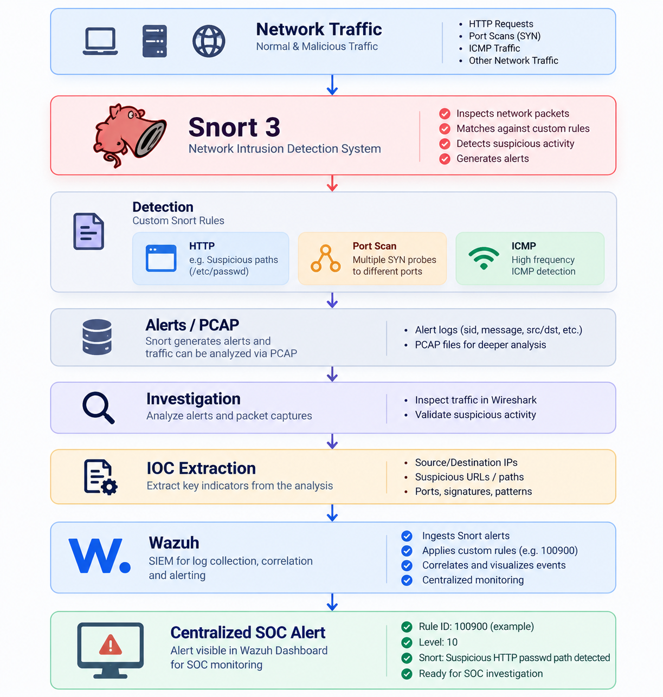
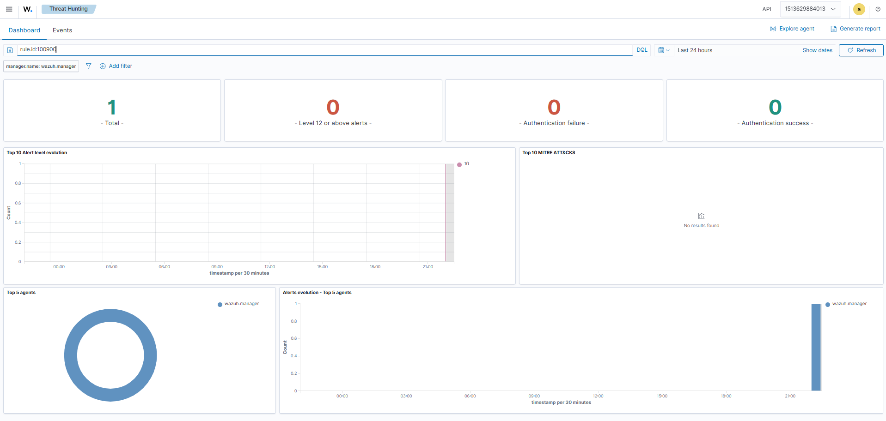
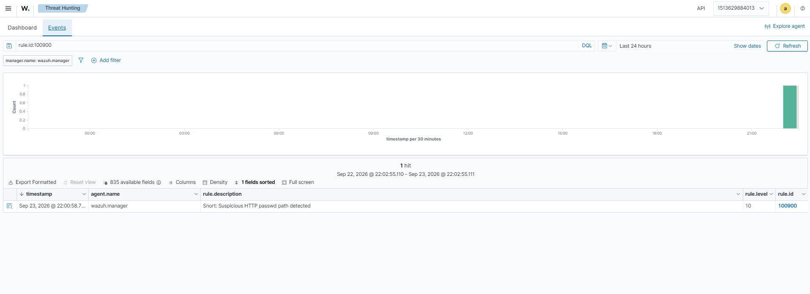
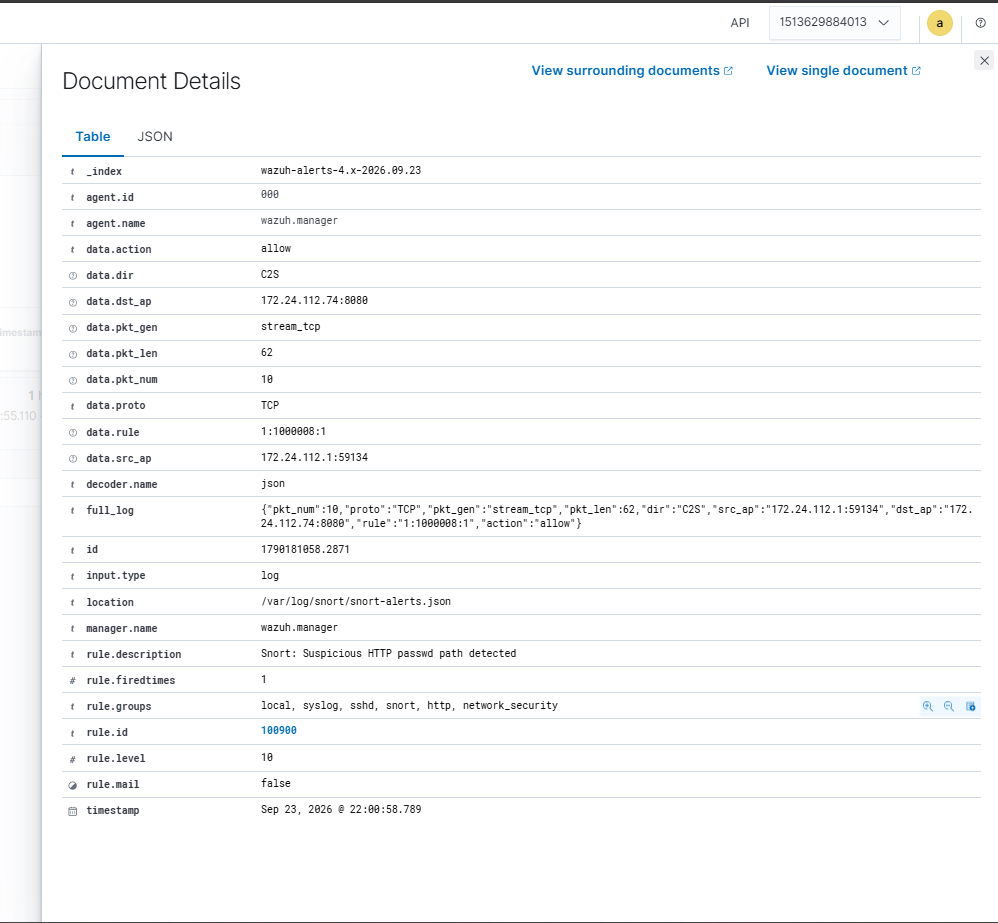

# 🛡️ Lab 10 --- Snort → Wazuh Integration
### Forwarding Snort Network Alerts into a Centralized SOC Platform

> Lab objective: Generate Snort JSON telemetry, ingest it into Wazuh, apply a custom Wazuh detection rule, troubleshoot an indexing issue, and verify the resulting alert in Wazuh Threat Hunting.

---

## 📌 Overview

Snort provides network detection telemetry. Wazuh provides centralized log collection, correlation, alerting and investigation visibility.

The integration built in this lab was:

```text
Network Traffic
      ↓
   Snort 3
      ↓
 JSON Alert
      ↓
 Wazuh Manager
      ↓
 Custom Wazuh Rule
      ↓
 Wazuh Indexer
      ↓
 Wazuh Dashboard
      ↓
 SOC Investigation
```



---

## 🎯 Objectives

- Generate Snort JSON alerts.
- Feed Snort telemetry into Wazuh.
- Create a custom Wazuh rule for the Snort SID.
- Validate the Wazuh decoder and rule.
- Troubleshoot an indexing problem.
- Verify the alert in Threat Hunting.

---

## 🖥️ Lab Environment

| Component | Version / Role |
|---|---|
| Snort | 3.12.2.0 |
| Wazuh | 4.14.6 |
| Wazuh Manager | Alert analysis |
| Wazuh Indexer | Event indexing |
| Wazuh Dashboard | Threat Hunting / visualization |
| Docker | Wazuh deployment |
| Ubuntu / WSL2 | Snort environment |

The Wazuh deployment used three containers:

```text
single-node-wazuh.manager-1
single-node-wazuh.indexer-1
single-node-wazuh.dashboard-1
```

---

## ⚙️ Snort JSON Output

Snort was configured to generate a compact JSON event containing fields useful for Wazuh correlation:

```json
{
  "pkt_num": 10,
  "proto": "TCP",
  "pkt_gen": "stream_tcp",
  "pkt_len": 62,
  "dir": "C2S",
  "src_ap": "172.24.112.1:59134",
  "dst_ap": "172.24.112.74:8080",
  "rule": "1:1000008:1",
  "action": "allow"
}
```

The exact command is preserved in:

`rules/snort-json-command.txt`

---

## ⚙️ Wazuh Log Collection

The Wazuh manager was configured to read the Snort JSON log:

```xml
<localfile>
  <log_format>json</log_format>
  <location>/var/log/snort/snort-alerts.json</location>
</localfile>
```

The configuration is preserved in:

`rules/wazuh-localfile.xml`

---

## 🧪 Custom Wazuh Rule

The Snort SID was mapped to a Wazuh rule:

```xml
<rule id="100900" level="10">
  <field name="rule">^1:1000008:1$</field>
  <description>Snort: Suspicious HTTP passwd path detected</description>
  <group>snort,http,network_security,</group>
</rule>
```

The rule is preserved in:

`rules/wazuh-local-rule.xml`

---

## 🔧 Troubleshooting the Integration

The first JSON event included Snort's human-formatted timestamp. Wazuh/Filebeat attempted to index the field as a date and the Indexer rejected the event because the timestamp format was incompatible with the field mapping.

The integration was corrected by generating the Snort JSON event without that problematic timestamp field and allowing Wazuh to use its own event timestamp.

This was an important practical lesson: **integrations can fail even when the detection itself is working correctly**. Log format, field names and downstream index mappings all matter.

---

## 🔎 Wazuh Verification

The custom rule was successfully validated using Wazuh log testing, and the manager configuration passed its validation.

The Wazuh Threat Hunting view then showed the Snort-derived alert.



The event search showed the custom Wazuh rule:

```text
rule.id:100900
```



The indexed event contained the Snort source, destination and rule information.



---

## 📊 Final Integration Result

The final verified flow was:

```text
Snort Alert
   ↓
JSON Log
   ↓
Wazuh Manager
   ↓
Rule 100900
   ↓
Wazuh Indexer
   ↓
Threat Hunting
```

The resulting Wazuh alert had:

- Rule ID: `100900`
- Level: `10`
- Description: `Snort: Suspicious HTTP passwd path detected`
- Snort rule: `1:1000008:1`
- Source: `172.24.112.1:59134`
- Destination: `172.24.112.74:8080`
- Decoder: `json`
- Location: `/var/log/snort/snort-alerts.json`

---

## 🧠 What I Learned

This lab connected a standalone network IDS to a centralized SOC platform.

```text
Detection
   ↓
Telemetry
   ↓
Collection
   ↓
Parsing
   ↓
Rule Matching
   ↓
Indexing
   ↓
Visualization
   ↓
Investigation
```

It also reinforced the importance of troubleshooting the complete telemetry pipeline rather than assuming that an alert not appearing in the dashboard means the detection failed.

---

## 🚨 SOC Relevance

This integration is more representative of real SOC architecture than using an IDS in isolation.

Snort provides network visibility while Wazuh provides centralized alerting and investigation capabilities.

The combination allows an analyst to move from:

```text
Network Detection
      ↓
Centralized Alert
      ↓
Threat Hunting
      ↓
Investigation
```

---

## 🎤 Interview Questions

### How did you integrate Snort with Wazuh?

Snort generated JSON telemetry, Wazuh collected the JSON log, a custom Wazuh rule matched the Snort SID, and the resulting event was indexed and displayed in Wazuh Threat Hunting.

### What problem did you encounter?

The initial Snort JSON timestamp was incompatible with a downstream Indexer field mapping. I resolved it by generating the JSON event without that timestamp field and allowing Wazuh to timestamp the event.

### What was the final Wazuh rule?

Rule `100900`, level `10`, matching Snort rule `1:1000008:1`.

---

## 🧪 Lab Outcome

Snort network detections were successfully integrated into Wazuh and became visible as centralized SOC alerts.

---

## 🔗 Related Work

Previous: [Lab 9 --- SOC Alert Investigation](Lab-9-SOC-Alert-Investigation.md)  
Next: [Lab 11 --- Mini SOC Detection & Investigation](Lab-11-Mini-SOC-Detection-Investigation.md)

---

## 👨‍💻 Author

Josh Yadav  
Computer Science Engineering Student  
Cybersecurity · SOC · Blue Team · SIEM · Incident Response
