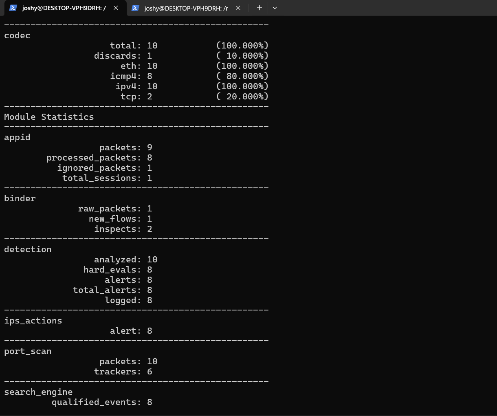

# 🛡️ Lab 3 --- Basic ICMP Detection with Snort
### Writing and Testing a Custom Network Detection Rule

> Lab objective: Write a custom Snort rule to detect ICMP traffic, replay a controlled PCAP, and verify that the rule generates the expected alerts.

---

## 📌 Overview

This was the first practical detection-engineering lab. Instead of relying only on Snort's default rules, I created a custom rule and tested it against a controlled ICMP PCAP.

The workflow was:

```text
ICMP Traffic
     ↓
PCAP Capture
     ↓
Custom Snort Rule
     ↓
Rule Match
     ↓
Alert
```

---

## 🎯 Objectives

- Write a basic Snort rule.
- Understand protocol-based matching.
- Replay a PCAP through Snort.
- Verify alert counts.
- Understand the difference between observed traffic and detected traffic.

---

## 🧪 Custom Rule

```text
alert icmp any any -> any any (msg:"LAB - ICMP Traffic Detected"; sid:1000001; rev:1;)
```

The rule detects ICMP traffic regardless of source or destination.

The rule is also stored in:

`rules/icmp.rules`

---

## ⚙️ Detection Test

The rule was replayed against the controlled ICMP PCAP:

```bash
snort -c /usr/local/etc/snort/snort.lua -R ~/icmp.rules -r ~/snort-lab.pcap
```

The PCAP contained 10 packets, including 8 ICMPv4 packets.

### Result

- Packets analyzed: `10`
- ICMP packets: `8`
- Alerts: `8`
- Logged alerts: `8`



A second captured view of the same detection result is retained as additional evidence:


---

## 🔎 Interpretation

The eight ICMP packets matched the rule, producing eight alerts.

This demonstrates that Snort can be used to create targeted detections instead of relying exclusively on pre-existing rules.

---

## 🧠 What I Learned

The practical relationship is:

```text
Protocol
   ↓
Rule Condition
   ↓
Traffic Match
   ↓
Alert
```

I also learned that the number of alerts is directly related to how broadly the rule is written and how much matching traffic is present.

---

## 🚨 SOC Relevance

A basic ICMP rule can provide useful visibility, but ICMP itself is not inherently malicious. A real SOC would normally add context such as:

- Source and destination
- Frequency
- Network segment
- Host role
- Time of activity
- Other related alerts

This led directly to the network-aware and detection-tuning labs.

---

## 🎤 Interview Questions

### What does this rule detect?

It alerts on ICMP traffic from any source to any destination.

### Why can a broad ICMP rule be noisy?

Because legitimate systems routinely use ICMP. A broad rule can therefore generate many alerts and require additional filtering or contextual analysis.

### What is a SID?

A Snort Signature ID identifies a detection rule. I used local lab SIDs such as `1000001` for my custom rules.

---

## 🧪 Lab Outcome

A custom ICMP detection rule was successfully written, replayed against a PCAP and validated through Snort statistics.

---

## 🔗 Related Work

Previous: [Lab 2 --- Traffic Capture & PCAP Replay](Lab-2-Traffic-Capture-and-PCAP-Replay.md)  
Next: [Lab 4 --- Network-Aware Detection](Lab-4-Network-Aware-Detection.md)

---

## 👨‍💻 Author

Josh Yadav  
Computer Science Engineering Student  
Cybersecurity · SOC · Blue Team · SIEM · Incident Response
