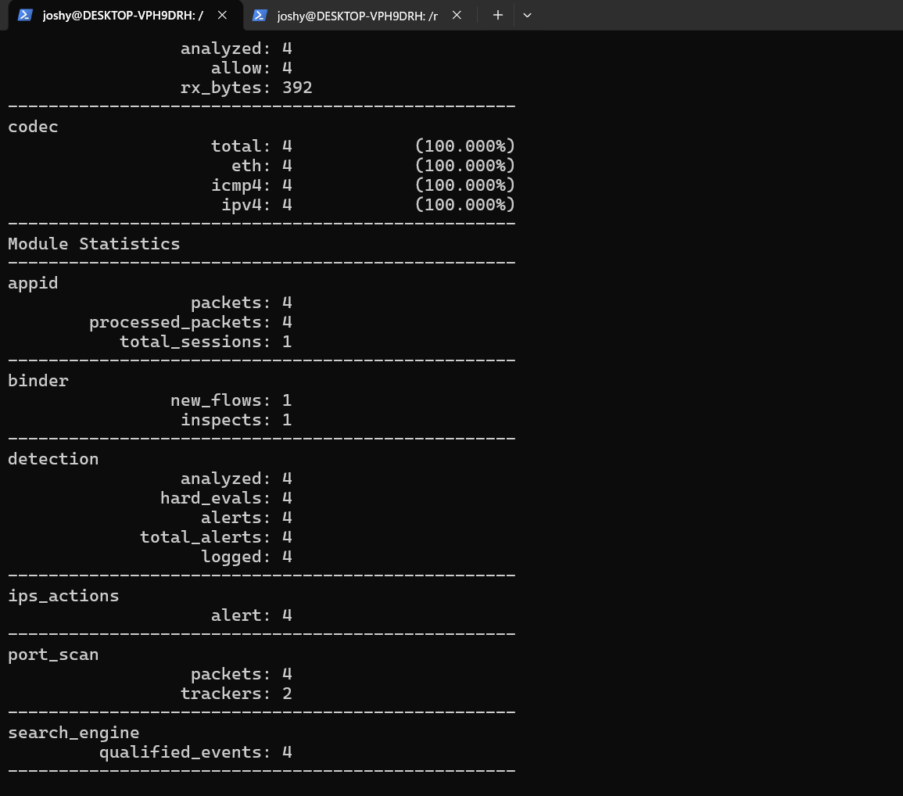

# 🛡️ Lab 4 --- Network-Aware ICMP Detection
### Restricting Detection to a Specific Network Segment

> Lab objective: Improve a broad ICMP rule by restricting detection to the WSL network and validate the rule against captured network traffic.

---

## 📌 Overview

Lab 3 demonstrated a very broad detection. In this lab, I added network context so the rule focused on traffic destined for the WSL network.

The controlled network was:

```text
172.24.112.0/20
```

The workflow was:

```text
ICMP Traffic
     ↓
Network-Aware Rule
     ↓
172.24.112.0/20
     ↓
Snort Alert
```

---

## 🎯 Objectives

- Understand CIDR-based rule targeting.
- Restrict a detection to a known network.
- Capture network traffic on `eth0`.
- Replay the PCAP through Snort.
- Understand how detection scope affects alert context.

---

## 🧪 Custom Rule

```text
alert icmp any any -> 172.24.112.0/20 any (msg:"LAB - ICMP To WSL Network"; sid:1000002; rev:1;)
```

The rule is stored in:

`rules/network.rules`

---

## ⚙️ Traffic Capture

Traffic was captured from the WSL `eth0` interface. A controlled ICMP test generated a four-packet capture.

The PCAP was then replayed through Snort.

### Result

- Packets analyzed: `4`
- Alerts: `4`
- Logged alerts: `4`



---

## 🔎 Interpretation

The rule matched ICMP traffic whose destination belonged to the configured WSL network.

This demonstrates an important detection-engineering principle: **scope matters**. A rule can become more useful when it is constrained to the network, host or service that the analyst actually wants to monitor.

---

## 🧠 What I Learned

```text
Broad Detection
      ↓
Add Network Context
      ↓
Narrow Detection Scope
      ↓
Improve Investigation Context
```

A detection should be designed around the environment being monitored rather than written as broadly as possible.

---

## 🚨 SOC Relevance

Network-aware detections can reduce unnecessary matches and make an alert easier to interpret.

For example, an analyst may want to detect traffic specifically targeting:

- A server subnet
- A DMZ
- A production VLAN
- A critical host
- A monitored service

---

## 🎤 Interview Questions

### Why restrict a Snort rule to a network?

To focus the detection on the traffic that is relevant to the monitored environment and reduce unnecessary matches.

### What does `/20` mean here?

It defines the CIDR prefix for the monitored network `172.24.112.0/20`.

---

## 🧪 Lab Outcome

A network-aware ICMP rule was successfully created and validated against captured traffic.

---

## 🔗 Related Work

Previous: [Lab 3 --- ICMP Detection](Lab-3-ICMP-Detection.md)  
Next: [Lab 5 --- Detection Tuning](Lab-5-Detection-Tuning.md)

---

## 👨‍💻 Author

Josh Yadav  
Computer Science Engineering Student  
Cybersecurity · SOC · Blue Team · SIEM · Incident Response
