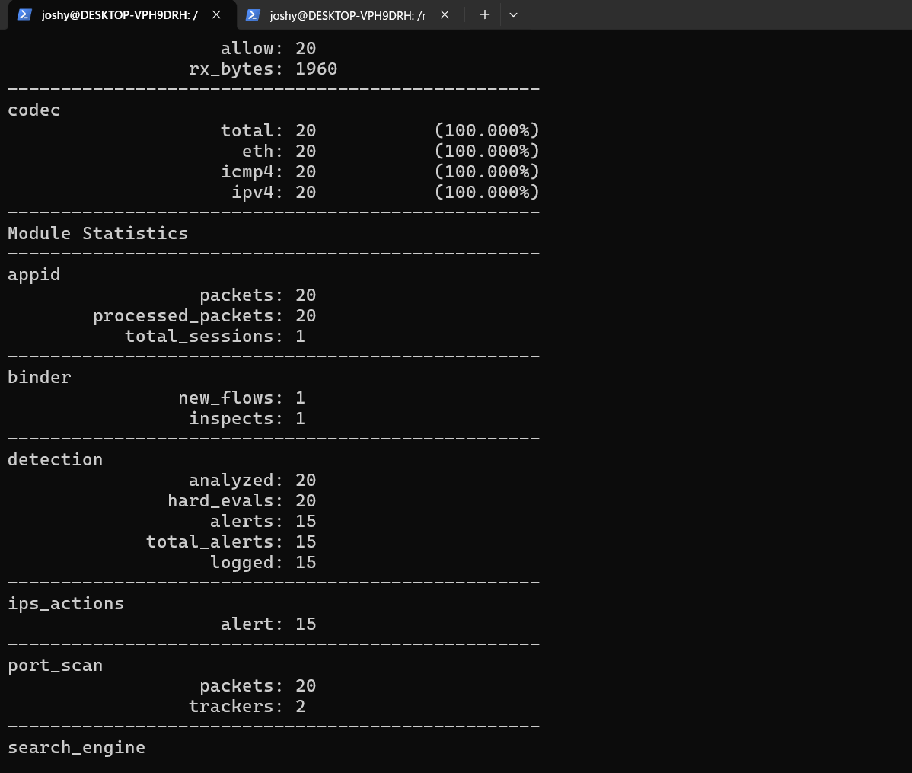
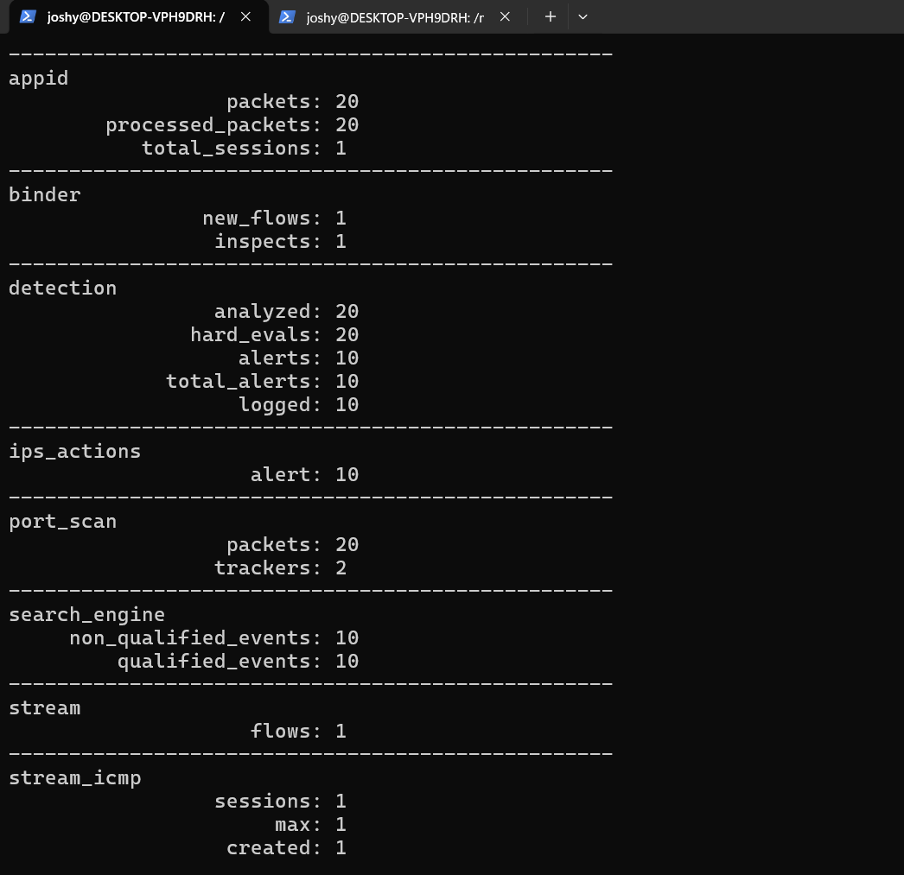

# 🛡️ Lab 5 --- Detection Filtering & Alert Tuning
### Reducing Detection Noise with `detection_filter`

> Lab objective: Understand how threshold-based detection changes alert volume and practice tuning a noisy ICMP frequency rule.

---

## 📌 Overview

A detection can be technically correct and still be operationally noisy.

This lab focused on that problem by generating repeated ICMP traffic and using Snort's `detection_filter` to control when alerts qualify.

The workflow was:

```text
Repeated ICMP Traffic
        ↓
Threshold-Based Rule
        ↓
Alert Qualification
        ↓
Measure Alert Volume
        ↓
Tune Threshold
        ↓
Compare Results
```

---

## 🎯 Objectives

- Understand `detection_filter`.
- Track repeated activity by source.
- Measure qualified and non-qualified events.
- Tune an alert threshold.
- Understand the relationship between sensitivity and alert volume.

---

## 🧪 Initial Rule

```text
alert icmp any any -> 127.0.0.1 any (msg:"LAB - ICMP High Frequency Detected"; detection_filter:track by_src,count 5,seconds 10; sid:1000004; rev:1;)
```

The original network-oriented version is also preserved in `rules/icmp-rate.rules`.

The loopback test generated 20 packets.

### Initial Result

- Packets analyzed: `20`
- Alerts: `15`
- Qualified events: `15`
- Non-qualified events: `5`



---

## ⚙️ Tuned Rule

The threshold was increased from five matches to ten matches within ten seconds:

```text
alert icmp any any -> 127.0.0.1 any (msg:"LAB - ICMP High Frequency Tuned"; detection_filter:track by_src,count 10,seconds 10; sid:1000005; rev:1;)
```

Stored in:

`rules/icmp-rate-tuned.rules`

### Tuned Result

- Packets analyzed: `20`
- Alerts: `10`
- Qualified events: `10`
- Non-qualified events: `10`



---

## 📊 Before vs After

| Measurement | Initial | Tuned |
|---|---:|---:|
| Packets analyzed | 20 | 20 |
| Alerts | 15 | 10 |
| Qualified events | 15 | 10 |
| Non-qualified events | 5 | 10 |
| Threshold | 5 / 10 sec | 10 / 10 sec |

The tuning reduced the number of generated alerts for the same traffic sample.

---

## 🔎 Analyst Interpretation

This exercise demonstrated an important SOC principle:

> More alerts do not automatically mean better detection.

A useful detection needs an appropriate balance between sensitivity and operational noise.

The correct threshold depends on the environment, expected baseline and security objective.

---

## 🧠 What I Learned

```text
Detection
   ↓
Measure Alert Volume
   ↓
Identify Noise
   ↓
Tune Threshold
   ↓
Re-test
   ↓
Compare Results
```

I also learned that an alert is not automatically malicious. The same ICMP traffic can be completely benign depending on context.

---

## 🚨 SOC Relevance

Detection tuning is directly relevant to SOC operations because excessive false positives and noisy rules can consume analyst attention.

Tuning can be used to:

- Reduce repeated alerts
- Focus on meaningful frequency patterns
- Improve alert quality
- Reduce analyst fatigue
- Make detections more operationally useful

---

## 🎤 Interview Questions

### What does `detection_filter` do?

It allows a rule to qualify activity based on a count within a time window instead of immediately alerting on every matching packet.

### Why tune a detection?

To balance sensitivity with alert volume and reduce unnecessary noise while preserving useful detection coverage.

### Did tuning prove the traffic was malicious?

No. The lab demonstrated detection behavior and alert tuning. The traffic itself was controlled test traffic.

---

## 🧪 Lab Outcome

A frequency-based ICMP detection was tested and tuned. The before/after comparison demonstrated how a threshold change can materially affect alert volume.

---

## 🔗 Related Work

Previous: [Lab 4 --- Network-Aware Detection](Lab-4-Network-Aware-Detection.md)  
Next: [Lab 6 --- TCP SYN Detection](Lab-6-TCP-SYN-Detection.md)

---

## 👨‍💻 Author

Josh Yadav  
Computer Science Engineering Student  
Cybersecurity · SOC · Blue Team · SIEM · Incident Response
