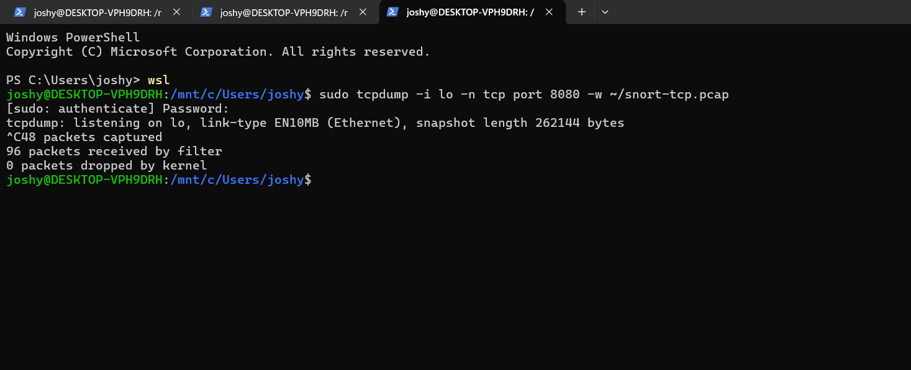
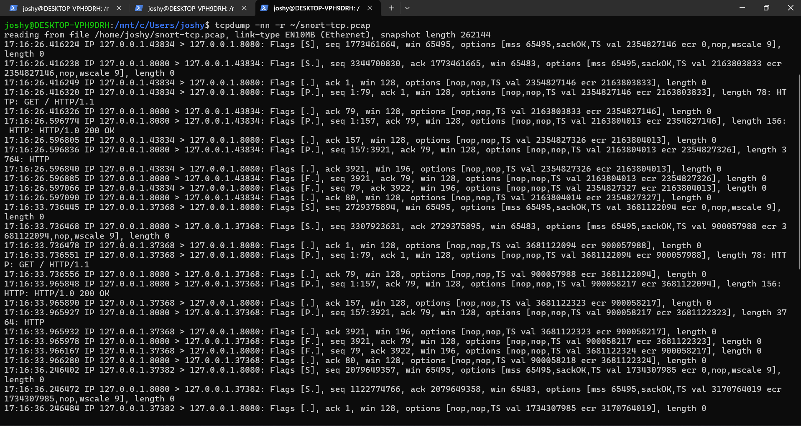
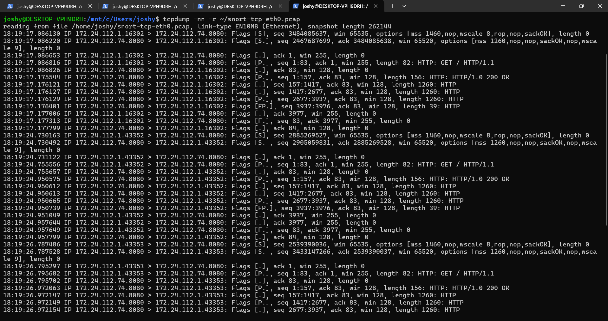
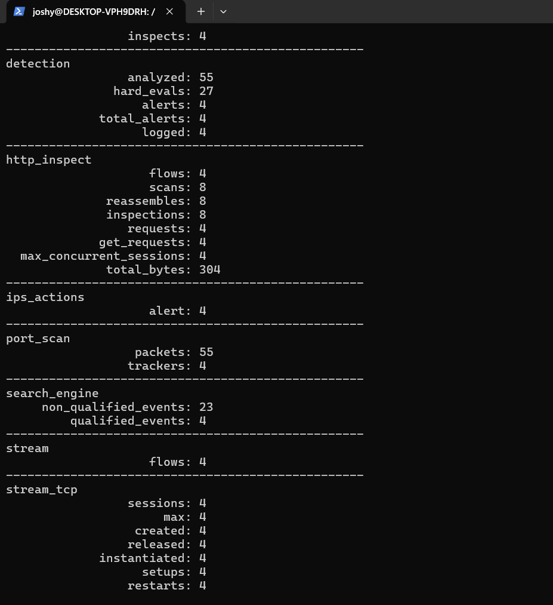

# 🛡️ Lab 6 --- TCP Traffic Analysis & SYN Detection
### Detecting TCP SYN Requests to a Controlled HTTP Service

> Lab objective: Capture clean TCP traffic on the WSL network interface, inspect the handshake, and create a Snort rule that detects TCP SYN requests to a controlled service.

---

## 📌 Overview

This lab moved from ICMP into TCP traffic and introduced service-specific detection.

A controlled Python HTTP server was exposed on port `8080`, and traffic was generated from the Windows host.

The workflow was:

```text
HTTP Client
    ↓
TCP Handshake
    ↓
Port 8080
    ↓
PCAP Capture
    ↓
Snort SYN Rule
    ↓
Alert
```

---

## 🎯 Objectives

- Capture TCP traffic.
- Understand the TCP three-way handshake.
- Identify SYN packets.
- Detect SYN requests to a specific service.
- Compare loopback and `eth0` traffic during troubleshooting.

---

## 🧪 Controlled HTTP Service

The service was started with:

```bash
python3 -m http.server 8080 --bind 0.0.0.0
```

WSL target:

```text
172.24.112.74:8080
```

Traffic was generated from Windows with:

```powershell
curl.exe http://172.24.112.74:8080
```

---

## 🔎 Capture & Troubleshooting

An initial loopback capture was also performed while testing the local service.



The loopback traffic showed the TCP/HTTP exchange but was not the cleanest representation for this lab. The capture was therefore moved to the WSL `eth0` interface for the final test.



The clean `eth0` capture showed the expected TCP handshake and HTTP exchange.



---

## 🧪 Custom SYN Rule

```text
alert tcp any any -> 172.24.112.74 8080 (msg:"LAB - TCP SYN to Port 8080 Detected"; flags:S; sid:1000007; rev:1;)
```

Stored in:

`rules/tcp-syn-eth0.rules`

The `flags:S` condition targets TCP SYN packets.

---

## ⚙️ Detection Test

The captured traffic contained:

- Packets received/analyzed: `55`
- TCP sessions: `4`
- SYNs detected by the traffic flow: `4`
- Snort alerts: `4`
- Logged alerts: `4`



---

## 🔎 Interpretation

The rule successfully identified SYN traffic directed to the controlled HTTP service.

The lab also reinforced an important operational lesson: **capture the traffic at the interface where the traffic actually traverses**. The clean `eth0` capture made the investigation easier than relying on loopback traffic.

---

## 🧠 What I Learned

```text
TCP Connection
      ↓
SYN
      ↓
SYN/ACK
      ↓
ACK
      ↓
Application Traffic
```

I also learned how protocol flags can be used as detection conditions in Snort rules.

---

## 🚨 SOC Relevance

TCP SYN visibility is useful for identifying:

- Connection attempts
- Service discovery
- Reconnaissance
- Repeated connection attempts
- Suspicious access to exposed services

However, a single SYN is not automatically malicious. Context and frequency matter.

---

## 🎤 Interview Questions

### What does the SYN flag represent?

It is used to initiate a TCP connection and synchronize sequence numbers during the TCP handshake.

### What did your Snort rule detect?

It detected TCP SYN packets directed at the controlled service on `172.24.112.74:8080`.

### Why did you move from loopback to `eth0`?

The `eth0` capture provided a cleaner representation of traffic traversing the WSL network interface and was better suited for the service-level detection exercise.

---

## 🧪 Lab Outcome

A controlled TCP service was captured, analyzed and successfully monitored with a custom SYN detection rule.

---

## 🔗 Related Work

Previous: [Lab 5 --- Detection Tuning](Lab-5-Detection-Tuning.md)  
Next: [Lab 7 --- Port Scan Detection](Lab-7-Port-Scan-Detection.md)

---

## 👨‍💻 Author

Josh Yadav  
Computer Science Engineering Student  
Cybersecurity · SOC · Blue Team · SIEM · Incident Response
