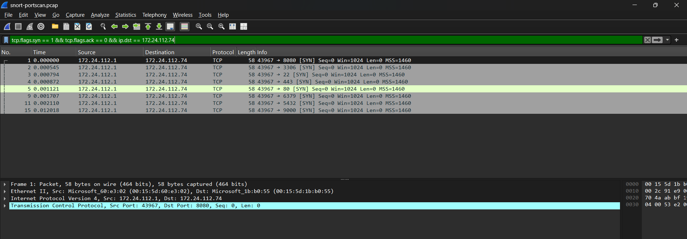
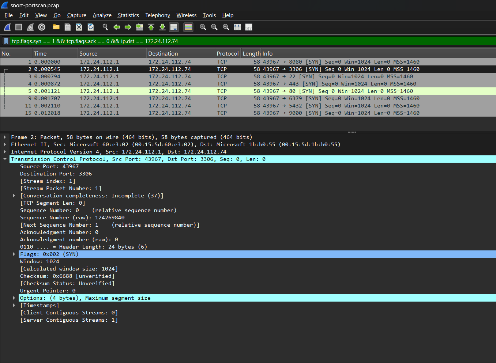
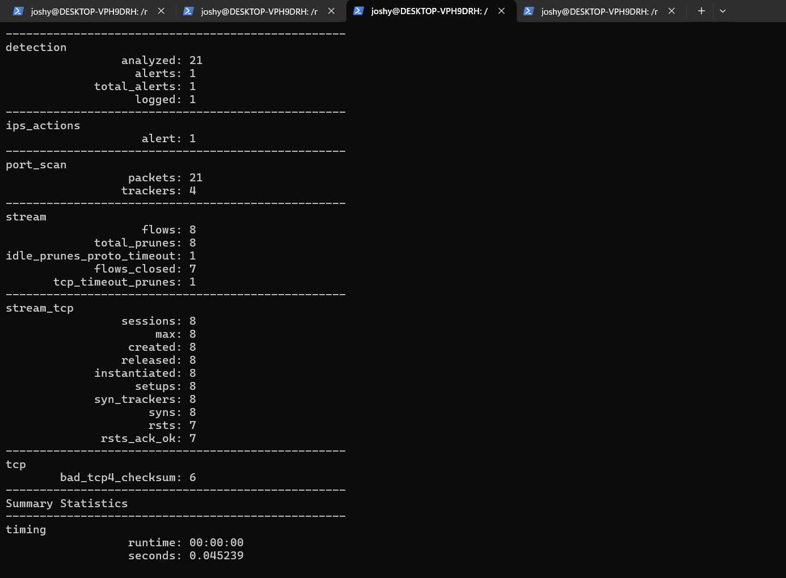

# 🛡️ Lab 7 --- Port Scan / Reconnaissance Detection
### Detecting Controlled TCP SYN Probing with Snort and Wireshark

> Lab objective: Generate controlled TCP reconnaissance traffic, inspect the SYN probes in Wireshark, and validate Snort's built-in port-scan detection logic.

---

## 📌 Overview

Port scanning is a common reconnaissance technique used to identify reachable services. In this controlled lab, the Windows host probed the WSL target on multiple TCP ports.

The workflow was:

```text
Controlled Nmap Scan
       ↓
TCP SYN Probes
       ↓
PCAP Capture
       ↓
Wireshark Analysis
       ↓
Snort Port-Scan Detection
       ↓
Alert
```

---

## 🎯 Objectives

- Generate controlled TCP SYN probes.
- Capture reconnaissance traffic.
- Filter SYN packets in Wireshark.
- Understand Snort port-scan detection.
- Tune the built-in port-scan thresholds for the lab.

---

## 🖥️ Target

WSL target:

```text
172.24.112.74
```

The test web service was available on port `8080`.

Nmap was used only against the controlled local lab target.

---

## 🔎 Wireshark Investigation

The following filter was used:

```text
tcp.flags.syn == 1 && tcp.flags.ack == 0 && ip.dst == 172.24.112.74
```

The capture showed SYN probes to multiple ports including:

```text
8080
3306
22
443
80
6379
5432
9000
```



A detailed packet view showed the TCP destination port and SYN flag information.



---

## ⚙️ Snort Port-Scan Detection

Snort's built-in port-scan rules were enabled with lab-specific thresholds:

```text
ips.enable_builtin_rules = true
port_scan.tcp_ports.scans = 5
port_scan.tcp_ports.rejects = 3
port_scan.tcp_ports.ports = 5
port_scan.tcp_window = 10
```

The replay command used these temporary Lua overrides:

```bash
snort -c /usr/local/etc/snort/snort.lua \
  -r ~/snort-portscan.pcap \
  --lua 'ips.enable_builtin_rules = true; port_scan.tcp_ports.scans = 5; port_scan.tcp_ports.rejects = 3; port_scan.tcp_ports.ports = 5; port_scan.tcp_window = 10'
```

---

## 📊 Detection Result

- Rules loaded: `866`
- Packets received/analyzed: `21`
- TCP sessions: `8`
- SYNs: `8`
- Alerts: `1`

The generated alert was a Snort built-in port-scan detection:

```text
(port_scan) TCP filtered portscan
```



---

## 🔎 Analyst Interpretation

The traffic is consistent with network reconnaissance because one source generated SYN probes to multiple destination ports.

The evidence demonstrates detection of reconnaissance behavior. It does **not** by itself demonstrate successful exploitation or compromise.

---

## 🧠 What I Learned

```text
Multiple SYN Probes
       ↓
Multiple Destination Ports
       ↓
Port-Scan Pattern
       ↓
Snort Port-Scan Detection
       ↓
SOC Investigation
```

I learned how network-level reconnaissance can be detected using both packet-level evidence and IDS detection logic.

---

## 🚨 SOC Relevance

Port-scan detections can help analysts identify early reconnaissance activity.

A SOC investigation would normally examine:

- Source IP
- Destination host
- Ports targeted
- Scan timing
- Number of hosts targeted
- Whether any ports responded
- Related authentication or application events

---

## 🎤 Interview Questions

### What is a port scan?

It is a technique used to probe network ports in order to discover reachable services or understand a target's exposed attack surface.

### What evidence did you observe?

Wireshark showed multiple TCP SYN probes from the same source to multiple ports on the WSL target, and Snort generated a port-scan alert.

### Does a port-scan alert mean compromise?

No. It indicates reconnaissance-like network activity. Further investigation is required to determine whether any subsequent malicious activity occurred.

---

## 🧪 Lab Outcome

Controlled reconnaissance traffic was captured, analyzed in Wireshark and successfully detected by Snort's port-scan detection logic.

---

## 🔗 Related Work

Previous: [Lab 6 --- TCP SYN Detection](Lab-6-TCP-SYN-Detection.md)  
Next: [Lab 8 --- HTTP Detection](Lab-8-HTTP-Detection.md)

---

## 👨‍💻 Author

Josh Yadav  
Computer Science Engineering Student  
Cybersecurity · SOC · Blue Team · SIEM · Incident Response
