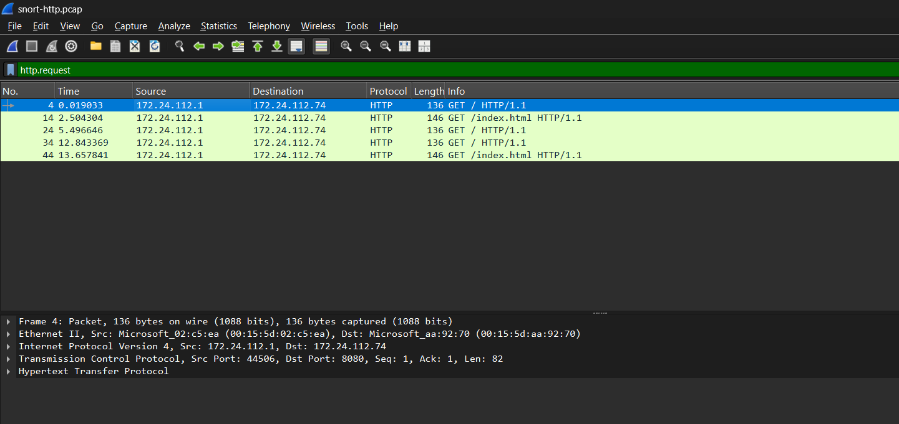
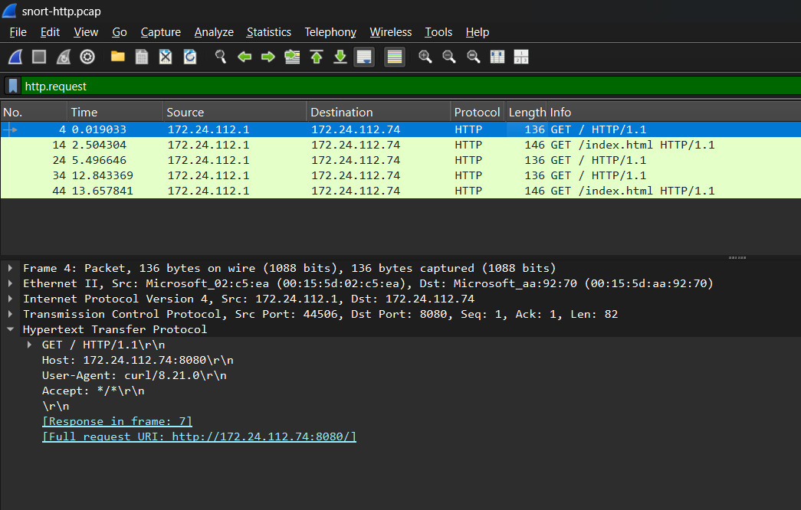
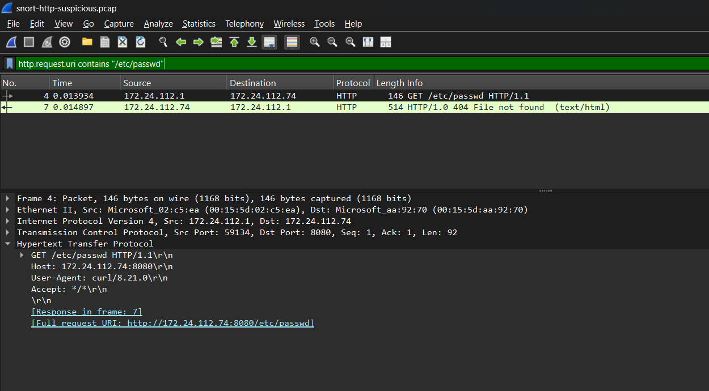
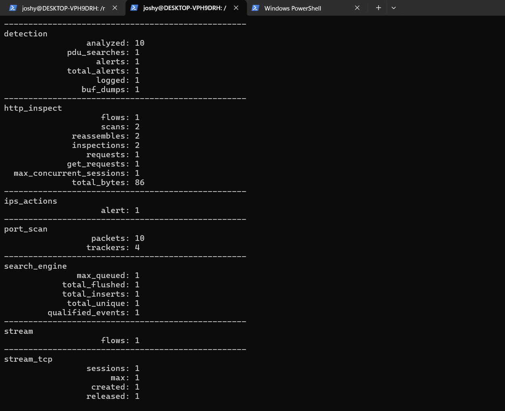

# 🛡️ Lab 8 --- HTTP / Web Detection
### Detecting a Suspicious `/etc/passwd` Request with Snort

> Lab objective: Inspect HTTP traffic, establish a normal baseline, create a content-aware Snort rule, and detect a suspicious HTTP URI in a controlled environment.

---

## 📌 Overview

This lab introduced application-layer detection.

Instead of detecting only protocol or TCP flags, the rule inspected the HTTP URI and searched for a suspicious path.

The workflow was:

```text
HTTP Traffic
     ↓
HTTP Inspection
     ↓
URI Content Match
     ↓
Snort Alert
     ↓
PCAP Validation
```

---

## 🎯 Objectives

- Capture normal HTTP traffic.
- Establish a benign baseline.
- Inspect HTTP requests in Wireshark.
- Write an HTTP content-based Snort rule.
- Detect a suspicious URI.
- Compare normal and suspicious traffic.

---

## 🧪 Normal HTTP Baseline

The normal PCAP contained routine requests to the controlled HTTP server.



A packet-level view showed a normal request such as:

```text
GET / HTTP/1.1
Host: 172.24.112.74:8080
User-Agent: curl/8.21.0
```



The normal PCAP was replayed through the HTTP rule with no alert generated.

---

## 🧪 Suspicious HTTP Request

The controlled suspicious request was:

```text
GET /etc/passwd HTTP/1.1
```

The server returned:

```text
HTTP/1.0 404 File not found
```

Wireshark evidence showed the request and response:



---

## ⚙️ Custom Snort Rule

```text
alert http any any -> 172.24.112.74 8080 (msg:"LAB - Suspicious HTTP passwd Path"; http_uri; content:"/etc/passwd"; sid:1000008; rev:1;)
```

Stored in:

`rules/http.rules`

The important detection options are:

- `alert` — generate an alert.
- `http` — inspect HTTP traffic.
- `http_uri` — inspect the URI field.
- `content:"/etc/passwd"` — search for the suspicious path.
- `sid:1000008` — identify the local detection.

---

## 📊 Detection Results

### Suspicious PCAP

- Packets analyzed: `10`
- HTTP requests: `1`
- Alerts: `1`



### Normal PCAP

- Packets analyzed: `50`
- HTTP requests observed: `5`
- Alerts: `0`

This comparison demonstrated that the rule matched the suspicious URI without alerting on the normal baseline traffic.

---

## 🔎 Analyst Interpretation

The alert identifies a suspicious request attempting to access `/etc/passwd` through the controlled HTTP server.

The PCAP also showed a `404 File not found` response. Therefore, the available evidence does not show successful retrieval of the requested resource.

---

## 🧠 What I Learned

This lab moved detection from network/protocol metadata into application-layer content:

```text
Packet
  ↓
TCP
  ↓
HTTP
  ↓
URI
  ↓
Content Match
  ↓
Alert
```

---

## 🚨 SOC Relevance

Application-layer detections can provide more context than a generic network alert.

An analyst can investigate:

- Requested URI
- Source IP
- Destination IP
- User-Agent
- Response code
- Related requests
- Whether the requested resource was successfully returned

---

## 🎤 Interview Questions

### Why use `http_uri`?

It tells Snort to evaluate the HTTP URI field for the specified content condition.

### Did the alert prove successful file access?

No. The PCAP showed the suspicious request but also a 404 response. The alert indicated an attempted access pattern, not confirmed successful retrieval.

### Why create a normal baseline?

A baseline provides evidence that the detection does not unnecessarily trigger on routine traffic and helps an analyst understand expected behavior.

---

## 🧪 Lab Outcome

A content-aware HTTP detection was successfully created and validated against both normal and suspicious traffic.

---

## 🔗 Related Work

Previous: [Lab 7 --- Port Scan Detection](Lab-7-Port-Scan-Detection.md)  
Next: [Lab 9 --- SOC Alert Investigation](Lab-9-SOC-Alert-Investigation.md)

---

## 👨‍💻 Author

Josh Yadav  
Computer Science Engineering Student  
Cybersecurity · SOC · Blue Team · SIEM · Incident Response
