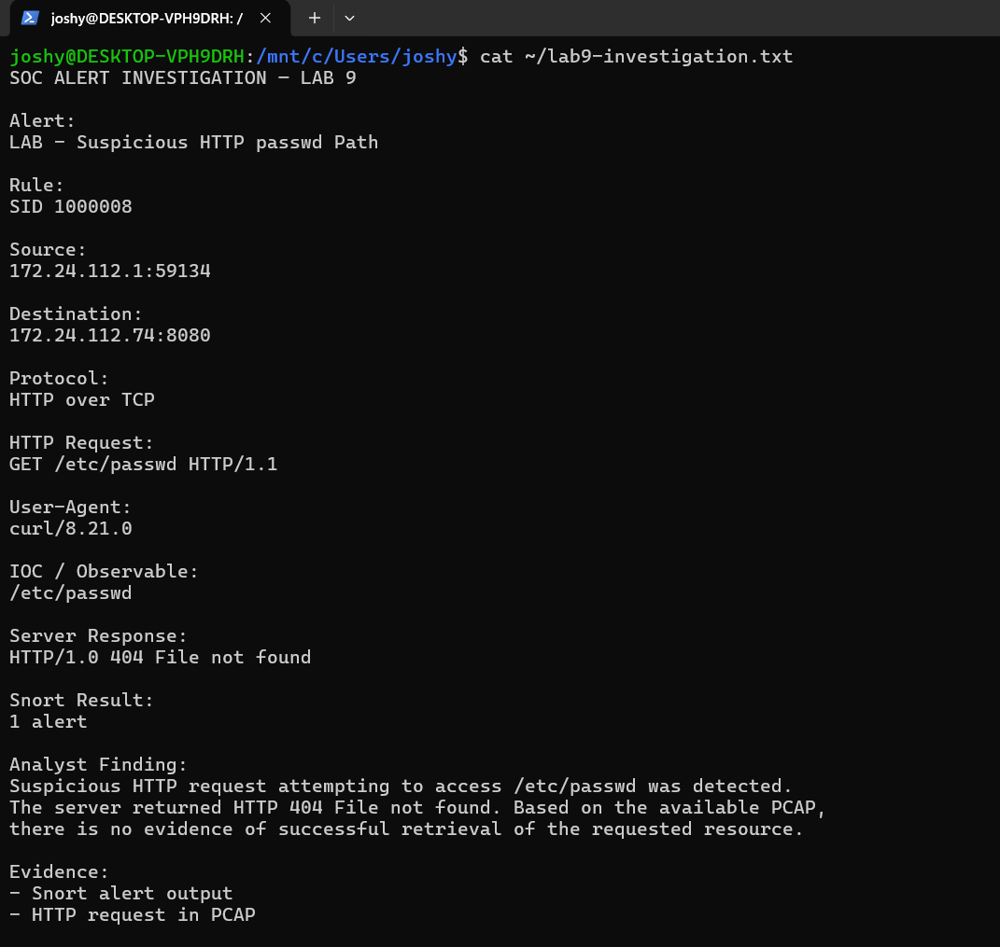

# 🛡️ Lab 9 --- SOC Alert Investigation & IOC Workflow
### Moving from Snort Detection to Evidence-Based Analyst Investigation

> Lab objective: Treat a Snort alert as the beginning of an investigation, extract useful indicators from the underlying PCAP, validate the server response, and document an analyst finding.

---

## 📌 Overview

A security alert is not the final answer. A SOC analyst needs to validate what actually happened.

This lab used the suspicious HTTP detection from Lab 8 and followed it through an investigation workflow:

```text
Snort Alert
     ↓
Triage
     ↓
Inspect PCAP
     ↓
Extract IOCs
     ↓
Validate Response
     ↓
Analyst Finding
```

---

## 🎯 Objectives

- Reproduce the Snort HTTP alert.
- Extract source and destination information.
- Identify the suspicious URI.
- Inspect the User-Agent.
- Validate the HTTP response.
- Document the investigation result.

---

## 🚨 Alert Details

```text
Alert:
LAB - Suspicious HTTP passwd Path

SID:
1000008

Source:
172.24.112.1:59134

Destination:
172.24.112.74:8080

Protocol:
HTTP over TCP
```

The underlying request was:

```text
GET /etc/passwd HTTP/1.1
```



---

## 🔎 PCAP Investigation

The Wireshark capture confirmed the HTTP request:


The observed User-Agent was:

```text
curl/8.21.0
```

The observable extracted from the request was:

```text
/etc/passwd
```

The server response was:

```text
HTTP/1.0 404 File not found
```

---

## 📋 Investigation Record

The investigation record was documented as:

```text
SOC ALERT INVESTIGATION — LAB 9

Alert:
LAB - Suspicious HTTP passwd Path

Rule:
SID 1000008

Source:
172.24.112.1:59134

Destination:
172.24.112.74:8080

Protocol:
HTTP over TCP

HTTP Request:
GET /etc/passwd HTTP/1.1

User-Agent:
curl/8.21.0

IOC / Observable:
/etc/passwd

Server Response:
HTTP/1.0 404 File not found

Snort Result:
1 alert
```

The full reusable case report is available at:

`reports/lab11-soc-case-report.md`

---

## 🔎 IOC Extraction

| Artifact | Value |
|---|---|
| Source IP | `172.24.112.1` |
| Source Port | `59134` |
| Destination IP | `172.24.112.74` |
| Destination Port | `8080` |
| Protocol | HTTP over TCP |
| URI | `/etc/passwd` |
| User-Agent | `curl/8.21.0` |
| Snort SID | `1000008` |

---

## 🧠 Analyst Assessment

The evidence supports the following conclusion:

> A suspicious HTTP request attempting to access `/etc/passwd` was detected. The controlled server returned HTTP 404, and the available PCAP provided no evidence of successful retrieval of the requested resource.

This distinction is important. The detection shows suspicious activity, but the PCAP must be checked before claiming successful exploitation or compromise.

---

## 🚨 SOC Relevance

The investigation demonstrates a practical SOC mindset:

```text
Alert
 ↓
What happened?
 ↓
Who initiated it?
 ↓
What was targeted?
 ↓
What did the server return?
 ↓
What evidence supports the conclusion?
 ↓
Is further escalation required?
```

---

## 🧠 What I Learned

The most important lesson was:

> Detection is the beginning of investigation, not the end.

A strong analyst should be able to connect the alert to the underlying evidence and avoid making claims that the evidence does not support.

---

## 🎤 Interview Questions

### What did you do after the Snort alert?

I inspected the underlying PCAP, extracted the source/destination details and suspicious URI, checked the User-Agent and validated the server response.

### What was the IOC in this exercise?

The suspicious URI `/etc/passwd` was the primary observable extracted from the HTTP request.

### Did you confirm compromise?

No. The server returned HTTP 404, and the available PCAP did not show successful retrieval of the requested resource.

---

## 🧪 Lab Outcome

The Snort alert was successfully transformed into a documented SOC investigation with packet-level evidence, extracted observables and a bounded analyst assessment.

---

## 🔗 Related Work

Previous: [Lab 8 --- HTTP Detection](Lab-8-HTTP-Detection.md)  
Next: [Lab 10 --- Snort → Wazuh Integration](Lab-10-Snort-Wazuh-Integration.md)

---

## 👨‍💻 Author

Josh Yadav  
Computer Science Engineering Student  
Cybersecurity · SOC · Blue Team · SIEM · Incident Response
