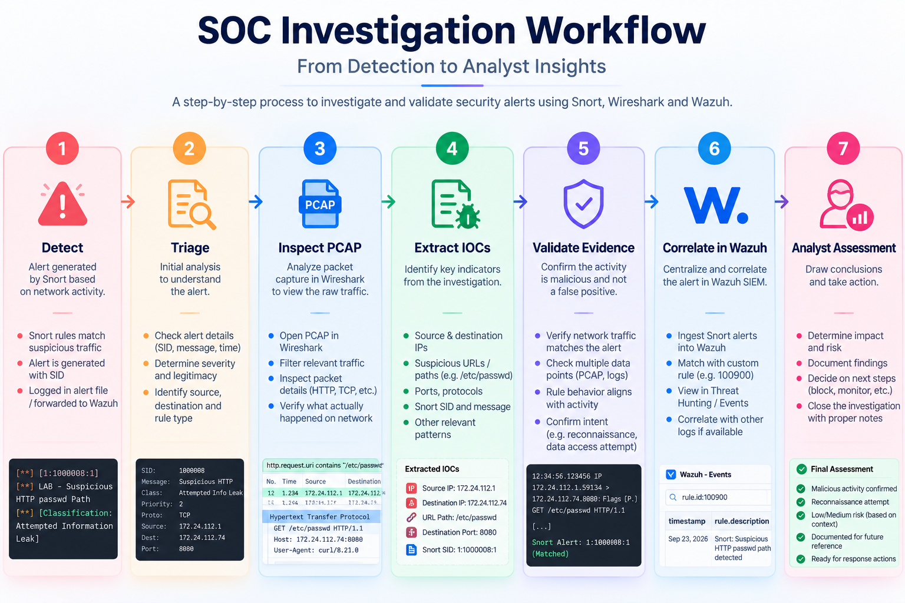

# 🛡️ Snort 3 SOC Labs
### Network Intrusion Detection, Detection Engineering, PCAP Investigation & Wazuh Integration

> A hands-on Snort 3 learning track documenting how I progressed from basic network detection rules to traffic analysis, detection tuning, TCP/SYN detection, port-scan detection, HTTP inspection, SOC alert investigation, and Snort → Wazuh SIEM integration.

---

## 📌 Overview

This folder contains the complete Snort portion of my cybersecurity/SOC lab work.

Rather than treating Snort as an isolated tool, the labs focus on the workflow a SOC analyst actually follows:

```text
Network Traffic
      ↓
   Snort 3
      ↓
 Detection
      ↓
 Alerts / PCAP
      ↓
 Investigation
      ↓
 IOC Extraction
      ↓
    Wazuh
      ↓
 Centralized SOC Alert
```

The Snort work is intentionally kept inside the larger Wazuh SOC repository as a dedicated `Snort/` section. Wazuh remains the primary SIEM/SOC platform, while Snort provides network intrusion detection telemetry.

---

## 🎯 What This Work Demonstrates

- Snort 3 installation and validation
- NIDS concepts and packet inspection
- Custom Snort rule writing
- ICMP detection
- Network-aware detection
- Detection thresholds and alert tuning
- TCP SYN detection
- PCAP capture and replay
- Wireshark packet analysis
- Controlled TCP port-scan detection
- HTTP request inspection
- Suspicious URI detection
- IOC extraction from PCAPs
- SOC alert triage and investigation
- Snort JSON logging
- Snort → Wazuh integration
- Custom Wazuh rule creation
- Centralized alert visibility in Wazuh Threat Hunting

---

## 🧪 Lab Progression

| Lab | Topic | Main Outcome |
|---|---|---|
| 1 | Snort Fundamentals | Understand Snort as a NIDS/NIPS and learn its workflow |
| 2 | Traffic Capture & PCAP Replay | Build the traffic → PCAP → Snort workflow |
| 3 | ICMP Detection | Write and test a basic custom rule |
| 4 | Network-Aware Detection | Restrict detection to a target network |
| 5 | Detection Tuning | Use `detection_filter` and compare alert volume |
| 6 | TCP SYN Detection | Detect TCP SYN traffic to a controlled service |
| 7 | Port Scan Detection | Detect controlled reconnaissance activity |
| 8 | HTTP Detection | Inspect HTTP and detect a suspicious URI |
| 9 | SOC Alert Investigation | Extract IOCs and validate an alert using PCAP evidence |
| 10 | Snort → Wazuh | Send Snort JSON telemetry into Wazuh and generate a custom alert |
| 11 | Mini SOC Investigation | Combine detection, investigation, validation and correlation |

---

## 🏗️ Architecture


The architecture shows the relationship between network traffic, Snort detections, PCAP-based investigation, IOC extraction and Wazuh centralized monitoring.

---

## 🕵️ SOC Investigation Workflow



The investigation process used throughout the project was:

```text
Detect
  ↓
Triage
  ↓
Inspect PCAP
  ↓
Extract IOCs
  ↓
Validate Evidence
  ↓
Correlate in Wazuh
  ↓
Analyst Assessment
```

---

## 🖥️ Lab Environment

| Component | Role |
|---|---|
| Ubuntu 26.04 LTS | Snort lab environment |
| WSL2 | Local Linux environment on Windows |
| Snort 3.12.2.0 | Network intrusion detection |
| tcpdump | Packet capture |
| Wireshark | Packet-level investigation |
| Nmap 7.98 | Controlled reconnaissance traffic generation |
| Python HTTP server | Controlled HTTP target |
| Wazuh 4.14.6 | SIEM, correlation and centralized alert visibility |
| Docker | Wazuh deployment |

### Network Details

- WSL interface: `eth0`
- WSL target IP: `172.24.112.74`
- WSL network: `172.24.112.0/20`
- Controlled HTTP service: `172.24.112.74:8080`

---

## 🔐 Security & Privacy

All activity was performed in a controlled local lab environment for defensive security learning.

- No real target systems were intentionally scanned.
- No real credentials are included.
- No API keys or tokens are included.
- PCAPs were generated locally during the exercises.
- The rules use lab-specific SIDs and controlled addresses.

---

## 🧠 Overall Learning Progression

```text
Snort Fundamentals
       ↓
Traffic Capture
       ↓
Custom Detection Rules
       ↓
Detection Tuning
       ↓
Network Recon Detection
       ↓
HTTP Inspection
       ↓
IOC Extraction
       ↓
SOC Investigation
       ↓
Wazuh Correlation
       ↓
Centralized SOC Visibility
```

The most important lesson was that **an alert is a starting point for investigation, not automatic proof of compromise**.

---

## 🎤 Interview Summary

> I built a practical Snort 3 NIDS lab and progressed from writing basic detection rules to network-aware detection, threshold tuning, TCP and port-scan detection, HTTP inspection, PCAP-based IOC investigation, and finally integrating Snort with Wazuh. I also built a small SOC investigation workflow where I compared benign and suspicious traffic and validated alerts against the underlying PCAP.

---

## 📂 Repository Structure

```text
Snort/
│
├── README.md
├── Lab-1-Snort-Fundamentals.md
├── Lab-2-Traffic-Capture-and-PCAP-Replay.md
├── Lab-3-ICMP-Detection.md
├── Lab-4-Network-Aware-Detection.md
├── Lab-5-Detection-Tuning.md
├── Lab-6-TCP-SYN-Detection.md
├── Lab-7-Port-Scan-Detection.md
├── Lab-8-HTTP-Detection.md
├── Lab-9-SOC-Alert-Investigation.md
├── Lab-10-Snort-Wazuh-Integration.md
├── Lab-11-Mini-SOC-Detection-Investigation.md
│
├── images/
│   ├── overview/
│   ├── lab-03/
│   ├── lab-04/
│   ├── lab-05/
│   ├── lab-06/
│   ├── lab-07/
│   ├── lab-08/
│   ├── lab-09/
│   ├── lab-10/
│   └── lab-11/
│
├── rules/
│   ├── icmp.rules
│   ├── network.rules
│   ├── icmp-rate.rules
│   ├── icmp-rate-loopback.rules
│   ├── icmp-rate-tuned.rules
│   ├── tcp-syn-eth0.rules
│   ├── http.rules
│   ├── wazuh-localfile.xml
│   ├── wazuh-local-rule.xml
│   └── snort-json-command.txt
│
├── reports/
│   └── lab11-soc-case-report.md
│
└── pcaps/
    └── README.md
```

---

## 👨‍💻 Author

**Josh Yadav**  
Computer Science Engineering Student  
`Cybersecurity` · `SOC` · `Blue Team` · `SIEM` · `Incident Response`

